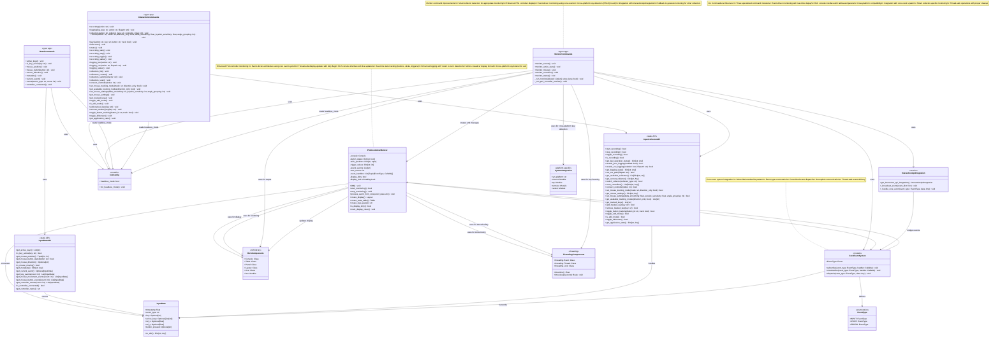

```mermaid
classDiagram
    %% ================================================================================
    %% COMMAND MODULES
    %% ================================================================================
    class DataCommands {
        <<typer app>>
        +active_keys() void
        +is_key_active(key: str) void
        +mouse_position() void
        +mouse_button(button: str) void
        +mouse_direction() void
        +metadata() void
        +current_event() void
        +events(event_type: str, count: int) void
        +controller_connected() void
    }

    class InteractionCommands {
        <<typer app>>
        +recording(action: str) void
        +logging(log_type: str, action: str, filepath: str) void
        +collectors(action: str, collector_type: str, controller_index: int) void
        +mouse(action: str, mode: str, direction_only: bool, delta_smoothing: float, joystick_sensitivity: float, angle_grouping: int) void
        +keys(action: str, key: str, button: str, track: bool) void
        +fullscreen() void
        +status() void
        +recording_start() void
        +recording_stop() void
        +recording_toggle() void
        +recording_status() void
        +logging_json(action: str) void
        +logging_csv(action: str, filepath: str) void
        +logging_status() void
        +collectors_list() void
        +collectors_current() void
        +collectors_switch(collector: str) void
        +collectors_scan() void
        +connect_controller(index: int) void
        +set_mouse_tracking_mode(mode: str, direction_only: bool) void
        +get_available_tracking_modes(direction_only: bool) void
        +set_mouse_settings(delta_smoothing: int, joystick_sensitivity: int, angle_grouping: int) void
        +get_mouse_settings() void
        +get_tracked_keys() void
        +toggle_edit_mode() void
        +is_edit_mode() void
        +add_tracked_key(key: str) void
        +remove_tracked_key(key: str) void
        +toggle_button_tracking(button_id: str, track: bool) void
        +toggle_fullscreen() void
        +get_application_state() void
    }

    class MonitorCommands {
        <<typer app>>
        +monitor_events() void
        +monitor_active_keys() void
        +monitor_mouse() void
        +monitor_controller() void
        +monitor_status() void
        -_run_monitor(allowed: List[str], show_keys: bool) void
        -_run_ps4_controller_monitor() void
    }

    %% ================================================================================
    %% PS4 CONTROLLER MONITOR
    %% ================================================================================
    class PS4ControllerMonitor {
        -console: Console
        -button_states: Dict[str, bool]
        -stick_positions: Dict[str, tuple]
        -trigger_values: Dict[str, int]
        -recent_events: List[str]
        -max_events: int
        -event_handlers: List[Tuple[EventType, Callable]]
        -display_dirty: bool
        -display_lock: threading.Lock

        +__init__() void
        +start_monitoring() bool
        +stop_monitoring() void
        +process_event_from_core(event_data: Any) void
        +create_display() Layout
        +create_state_table() Table
        +create_logs_panel() str
        +is_display_dirty() bool
        +mark_display_clean() void
    }

    %% ================================================================================
    %% CONFIGURATION AND SHARED COMPONENTS
    %% ================================================================================
    class CLIConfig {
        <<module>>
        +headless_mode: bool
        +init_headless_mode() void
    }

    %% ================================================================================
    %% API INTEGRATIONS
    %% ================================================================================
    class InputDataAPI {
        <<static API>>
        +get_active_keys() List[str]
        +is_key_active(key: str) bool
        +get_mouse_position() Tuple[int, int]
        +get_mouse_button_state(button: str) bool
        +get_mouse_direction() Optional[str]
        +is_mouse_moving() bool
        +get_metadata() Dict[str, Any]
        +get_current_event() Optional[InputData]
        +get_key_events(count: int) List[InputData]
        +get_mouse_movement_events(count: int) List[InputData]
        +get_mouse_button_events(count: int) List[InputData]
        +get_controller_events(count: int) List[InputData]
        +is_controller_connected() bool
        +get_controller_name() str
    }

    class InputCollectorAPI {
        <<static API>>
        +start_recording() bool
        +stop_recording() bool
        +toggle_recording() bool
        +is_recording() bool
        +get_last_operation_status() Dict[str, Any]
        +enable_json_logging(enabled: bool) bool
        +enable_csv_logging(enabled: bool, filepath: str) bool
        +get_logging_state() Dict[str, Any]
        +set_csv_path(filepath: str) bool
        +get_available_collectors() List[Dict[str, str]]
        +get_current_collector() Dict[str, Any]
        +switch_collector(collector_type: str) bool
        +scan_controllers() List[Dict[str, Any]]
        +connect_controller(index: int) bool
        +set_mouse_tracking_mode(mode: str, direction_only: bool) bool
        +get_mouse_settings() Dict[str, Any]
        +set_mouse_settings(delta_smoothing: float, joystick_sensitivity: float, angle_grouping: int) bool
        +get_available_tracking_modes(direction_only: bool) List[str]
        +get_tracked_keys() List[str]
        +add_tracked_key(key: str) bool
        +remove_tracked_key(key: str) bool
        +toggle_button_tracking(button_id: str, track: bool) bool
        +toggle_edit_mode() bool
        +is_edit_mode() bool
        +toggle_fullscreen() bool
        +get_application_state() Dict[str, Any]
    }

    %% ================================================================================
    %% CORE EVENT SYSTEM INTEGRATION
    %% ================================================================================
    class CoreEventSystem {
        <<module>>
        +EventType: Enum
        +subscribe(event_type: EventType, handler: Callable) void
        +unsubscribe(event_type: EventType, handler: Callable) void
        +dispatch(event_type: EventType, data: Any) void
    }

    class InteractionApiIntegration {
        <<service>>
        +get_interaction_api_integration() InteractionApiIntegration
        +_broadcast_event(event_dict: Dict) void
        +_handle_core_event(event_type: EventType, data: Any) void
    }

    %% ================================================================================
    %% RICH COMPONENTS FOR UI
    %% ================================================================================
    class RichComponents {
        <<rich library>>
        +Console: Class
        +Table: Class
        +Panel: Class
        +Layout: Class
        +Live: Class
        +box: Module
    }

    %% ================================================================================
    %% THREADING COMPONENTS
    %% ================================================================================
    class ThreadingComponents {
        <<threading>>
        +threading.Event: Class
        +threading.Thread: Class
        +threading.Lock: Class
        +time.time() float
        +time.sleep(seconds: float) void
    }

    %% ================================================================================
    %% SYSTEM INTEGRATION
    %% ================================================================================
    class SystemIntegration {
        <<platform specific>>
        +sys.platform: str
        +msvcrt: Module
        +tty: Module
        +termios: Module
        +select: Module
    }

    %% ================================================================================
    %% DATA STRUCTURES
    %% ================================================================================
    class InputData {
        +timestamp: float
        +event_type: str
        +key: Optional[str]
        +active_keys: Optional[List[str]]
        +rel_x: Optional[float]
        +rel_y: Optional[float]
        +button_pressed: Optional[str]
        +to_dict() Dict[str, Any]
    }

    class EventType {
        <<enumeration>>
        +INPUT: EventType
        +STATE: EventType
        +ERROR: EventType
    }

    %% ================================================================================
    %% RELATIONSHIPS
    %% ================================================================================

    %% Command Module Dependencies
    DataCommands --> InputDataAPI : uses
    DataCommands --> CLIConfig : uses
    InteractionCommands --> InputCollectorAPI : uses
    InteractionCommands --> CLIConfig : uses
    MonitorCommands --> InputCollectorAPI : uses
    MonitorCommands --> CLIConfig : uses
    MonitorCommands --> PS4ControllerMonitor : creates and manages
    MonitorCommands --> CoreEventSystem : uses
    MonitorCommands --> InteractionApiIntegration : uses

    %% PS4 Controller Monitor Dependencies
    PS4ControllerMonitor --> CoreEventSystem : subscribes to events
    PS4ControllerMonitor --> RichComponents : uses for display
    PS4ControllerMonitor --> ThreadingComponents : uses for concurrency
    PS4ControllerMonitor --> InputData : processes

    %% API Dependencies
    InputDataAPI --> InputData : returns
    InputCollectorAPI --> InputData : handles

    %% Core Event System
    CoreEventSystem --> EventType : defines
    CoreEventSystem --> InputData : transmits

    %% Rich UI Components
    PS4ControllerMonitor "1" --> "1" RichComponents : uses for rendering
    MonitorCommands --> RichComponents : uses for output

    %% Threading and Concurrency
    PS4ControllerMonitor --> ThreadingComponents : uses for thread safety
    MonitorCommands --> ThreadingComponents : uses for key listening

    %% Platform Integration
    MonitorCommands --> SystemIntegration : uses for cross-platform key detection

    %% Configuration
    DataCommands --> CLIConfig : reads headless_mode
    InteractionCommands --> CLIConfig : reads headless_mode
    MonitorCommands --> CLIConfig : reads headless_mode

    %% Event Flow
    CoreEventSystem --> PS4ControllerMonitor : delivers events
    PS4ControllerMonitor --> RichComponents : updates display
    InteractionApiIntegration --> CoreEventSystem : bridges events

    %% Notes
    note for PS4ControllerMonitor "Enhanced PS4 controller monitoring:\n• Event-driven architecture using core event system\n• Thread-safe display updates with dirty flag\n• Rich console interface with live updates\n• Real-time state tracking (buttons, sticks, triggers)\n• Enhanced logging with 'return to zero' detection\n• Mimics visualizer display format\n• Cross-platform key listener for exit"

    note for MonitorCommands "Monitor command improvements:\n• Smart collector detection for appropriate monitoring\n• Enhanced PS4 controller display\n• Event-driven monitoring using core events\n• Cross-platform key detection (ESC/Q to exit)\n• Integration with InteractionApiIntegration\n• Fallback to general monitoring for other collectors"

    note for CoreEventSystem "Core event system integration:\n• Subscribe/unsubscribe pattern\n• Event type enumeration\n• Centralized event dispatch\n• Decoupled communication\n• Thread-safe event delivery"

    note "CLI Commands Architecture:\n• Three specialized command modules\n• Event-driven monitoring with real-time display\n• Rich console interface with tables and panels\n• Cross-platform compatibility\n• Integration with core event system\n• Smart collector-specific monitoring\n• Thread-safe operations with proper cleanup"
```
