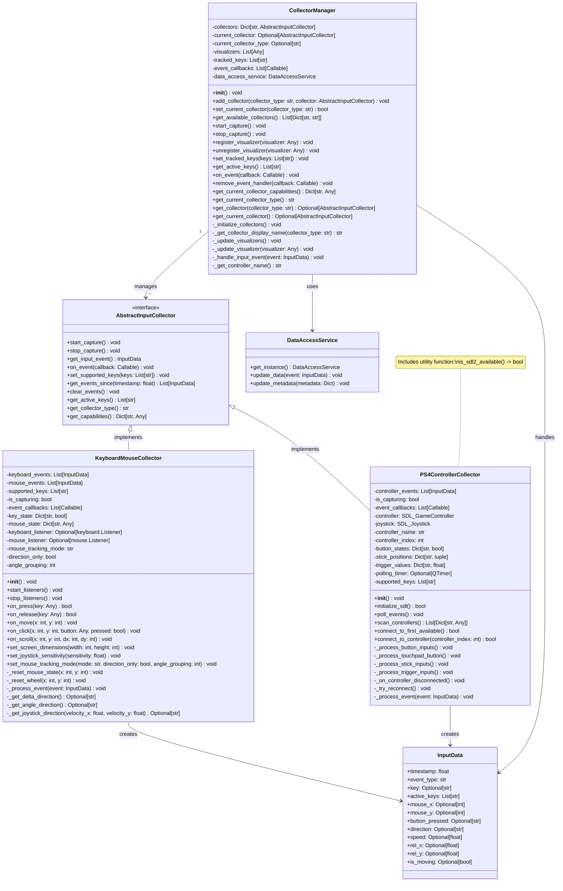

```mermaid
classDiagram
    %% Abstract Interface
    class AbstractInputCollector {
        <<interface>>
        +start_capture() void
        +stop_capture() void
        +get_input_event() InputData
        +on_event(callback: Callable) void
        +set_supported_keys(keys: List[str]) void
        +get_events_since(timestamp: float) List[InputData]
        +clear_events() void
        +get_active_keys() List[str]
        +get_collector_type() str
        +get_capabilities() Dict[str, Any]
    }

    %% Concrete Collectors
    class KeyboardMouseCollector {
        -keyboard_events: List[InputData]
        -mouse_events: List[InputData]
        -supported_keys: List[str]
        -is_capturing: bool
        -event_callbacks: List[Callable]
        -key_state: Dict[str, bool]
        -mouse_state: Dict[str, Any]
        -keyboard_listener: Optional[keyboard.Listener]
        -mouse_listener: Optional[mouse.Listener]
        -mouse_tracking_mode: str
        -direction_only: bool
        -angle_grouping: int

        +__init__() void
        +start_listeners() void
        +stop_listeners() void
        +on_press(key: Any) bool
        +on_release(key: Any) bool
        +on_move(x: int, y: int) void
        +on_click(x: int, y: int, button: Any, pressed: bool) void
        +on_scroll(x: int, y: int, dx: int, dy: int) void
        +set_screen_dimensions(width: int, height: int) void
        +set_joystick_sensitivity(sensitivity: float) void
        +set_mouse_tracking_mode(mode: str, direction_only: bool, angle_grouping: int) void
        -_reset_mouse_state(x: int, y: int) void
        -_reset_wheel(x: int, y: int) void
        -_process_event(event: InputData) void
        -_get_delta_direction() Optional[str]
        -_get_angle_direction() Optional[str]
        -_get_joystick_direction(velocity_x: float, velocity_y: float) Optional[str]
    }

    class PS4ControllerCollector {
        -controller_events: List[InputData]
        -is_capturing: bool
        -event_callbacks: List[Callable]
        -controller: SDL_GameController
        -joystick: SDL_Joystick
        -controller_name: str
        -controller_index: int
        -button_states: Dict[str, bool]
        -stick_positions: Dict[str, tuple]
        -trigger_values: Dict[str, float]
        -polling_timer: Optional[QTimer]
        -supported_keys: List[str]

        +__init__() void
        +initialize_sdl() bool
        +poll_events() void
        +scan_controllers() List[Dict[str, Any]]
        +connect_to_first_available() bool
        +connect_to_controller(controller_index: int) bool
        -_process_button_inputs() void
        -_process_touchpad_button() void
        -_process_stick_inputs() void
        -_process_trigger_inputs() void
        -_on_controller_disconnected() void
        -_try_reconnect() void
        -_process_event(event: InputData) void
    }

    class CollectorManager {
        -collectors: Dict[str, AbstractInputCollector]
        -current_collector: Optional[AbstractInputCollector]
        -current_collector_type: Optional[str]
        -visualizers: List[Any]
        -tracked_keys: List[str]
        -event_callbacks: List[Callable]
        -data_access_service: DataAccessService

        +__init__() void
        +add_collector(collector_type: str, collector: AbstractInputCollector) void
        +set_current_collector(collector_type: str) bool
        +get_available_collectors() List[Dict[str, str]]
        +start_capture() void
        +stop_capture() void
        +register_visualizer(visualizer: Any) void
        +unregister_visualizer(visualizer: Any) void
        +set_tracked_keys(keys: List[str]) void
        +get_active_keys() List[str]
        +on_event(callback: Callable) void
        +remove_event_handler(callback: Callable) void
        +get_current_collector_capabilities() Dict[str, Any]
        +get_current_collector_type() str
        +get_collector(collector_type: str) Optional[AbstractInputCollector]
        +get_current_collector() Optional[AbstractInputCollector]
        -_initialize_collectors() void
        -_get_collector_display_name(collector_type: str) str
        -_update_visualizers() void
        -_update_visualizer(visualizer: Any) void
        -_handle_input_event(event: InputData) void
        -_get_controller_name() str
    }

    %% Data Classes
    class InputData {
        +timestamp: float
        +event_type: str
        +key: Optional[str]
        +active_keys: List[str]
        +mouse_x: Optional[int]
        +mouse_y: Optional[int]
        +button_pressed: Optional[str]
        +direction: Optional[str]
        +speed: Optional[float]
        +rel_x: Optional[float]
        +rel_y: Optional[float]
        +is_moving: Optional[bool]
    }

    class DataAccessService {
        +get_instance() DataAccessService
        +update_data(event: InputData) void
        +update_metadata(metadata: Dict) void
    }

    %% Relationships
    AbstractInputCollector <|-- KeyboardMouseCollector : implements
    AbstractInputCollector <|-- PS4ControllerCollector : implements
    CollectorManager "1" --> "*" AbstractInputCollector : manages
    CollectorManager --> DataAccessService : uses
    KeyboardMouseCollector --> InputData : creates
    PS4ControllerCollector --> InputData : creates
    CollectorManager --> InputData : handles

    %% Utility Functions
    note for PS4ControllerCollector "Includes utility function:\nis_sdl2_available() -> bool"
```
