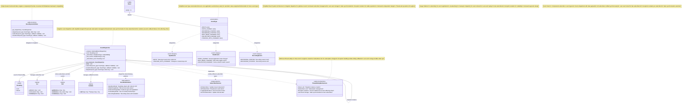

```mermaid
classDiagram
    %% Event Types Enumeration
    class EventType {
        <<enumeration>>
        +INPUT: auto()
        +STATE_CHANGE: auto()
        +RECORDING_STARTED: auto()
        +RECORDING_STOPPED: auto()
        +EDIT_MODE_CHANGED: auto()
        +COLLECTOR_CHANGED: auto()
        +TRACKED_KEYS_CHANGED: auto()
    }

    %% Core Event System Components
    class EventDispatcher {
        -_instance: Optional[EventDispatcher]
        -_lock: threading.Lock
        -_subscribers: Dict[EventType, Set[Callable]]
        -_last_events: Dict[EventType, Any]
        -_subscribers_lock: threading.Lock

        +get_instance()$ EventDispatcher
        +__init__() void
        +subscribe(event_type: EventType, callback: Callable) void
        +unsubscribe(event_type: EventType, callback: Callable) void
        +dispatch(event_type: EventType, data: Any) void
    }

    %% Utility Functions
    class EventSystemUtilities {
        <<utility functions>>
        +get_dispatcher() EventDispatcher
        +dispatch(event_type: EventType, data: Any) void
        +subscribe(event_type: EventType, callback: Callable) void
        +unsubscribe(event_type: EventType, callback: Callable) void
    }

    %% Standard Library Dependencies
    class threading {
        <<stdlib>>
        +Lock
        +RLock
    }

    class Enum {
        <<stdlib>>
        +auto() int
    }

    class Set {
        <<typing>>
        +add(item: Any) void
        +remove(item: Any) void
        +__contains__(item: Any) bool
    }

    class Dict {
        <<typing>>
        +__getitem__(key: Any) Any
        +__setitem__(key: Any, value: Any) void
        +__contains__(key: Any) bool
    }

    class Callable {
        <<typing>>
        +__call__(*args: Any, **kwargs: Any) Any
    }

    %% Event Categories by Purpose
    class InputEvents {
        <<event category>>
        +INPUT: "Raw input events from collectors"
        +TRACKED_KEYS_CHANGED: "Changes to tracked keys list"
    }

    class StateEvents {
        <<event category>>
        +STATE_CHANGE: "General application state changes"
        +EDIT_MODE_CHANGED: "Edit mode toggle events"
        +COLLECTOR_CHANGED: "Active collector switch events"
    }

    class RecordingEvents {
        <<event category>>
        +RECORDING_STARTED: "Recording session start"
        +RECORDING_STOPPED: "Recording session end"
    }

    %% Event Data Patterns
    class EventDataPatterns {
        <<data patterns>>
        +InputEventData: "InputData object with collector info"
        +StateChangeData: "Old and new state values"
        +CollectorChangeData: "Collector type and capabilities"
        +TrackedKeysData: "List of currently tracked keys"
        +RecordingStateData: "Recording status and metadata"
    }

    %% Subscriber Patterns
    class SubscriberPatterns {
        <<usage patterns>>
        +UISubscribers: "Update visual components"
        +APISubscribers: "Broadcast to web clients"
        +LoggingSubscribers: "Record events to files"
        +ServiceSubscribers: "Update internal state"
    }

    %% Relationships
    Enum <|-- EventType : inherits

    EventDispatcher --> threading : uses for thread safety
    EventDispatcher --> Set : manages subscriber sets
    EventDispatcher --> Dict : stores subscribers and last events
    EventDispatcher --> Callable : manages callback functions

    EventSystemUtilities --> EventDispatcher : delegates to singleton

    EventType ..> InputEvents : categorizes
    EventType ..> StateEvents : categorizes
    EventType ..> RecordingEvents : categorizes

    EventDispatcher ..> EventDataPatterns : dispatches data following patterns
    EventDispatcher ..> SubscriberPatterns : notifies different subscriber types

    %% Singleton Pattern
    EventDispatcher --|> EventDispatcher : singleton instance

    %% Thread Safety Components
    class ThreadSafetyMechanisms {
        <<safety mechanisms>>
        +Class Lock: "Singleton instance creation"
        +Subscribers Lock: "Subscription management"
        +Exception Isolation: "Prevent callback errors from affecting others"
        +Last Event Storage: "State synchronization for late subscribers"
    }

    EventDispatcher ..> ThreadSafetyMechanisms : implements

    %% Notes
    note for EventDispatcher "Singleton event dispatcher with simplified design\nThread-safe subscription management\nAutomatic state synchronization for late subscribers\nError isolation prevents callback failures from affecting others"

    note for EventType "Simplified event type enumeration\nCovers core application events\nUses auto() for automatic value assignment\nExtensible for future event types"

    note for EventSystemUtilities "Simple facade functions\nHides singleton complexity\nProvides convenient API\nMaintains backward compatibility"

    note for ThreadSafetyMechanisms "Multi-level thread safety:\n• Class lock for singleton creation\n• Subscribers lock for subscription changes\n• Exception handling isolates failing callbacks\n• Last event storage enables state sync"

    %% Architecture Documentation
    note "Simplified Event System Architecture:\n• Singleton dispatcher for global access\n• Set-based subscriber management\n• Last event storage for state synchronization\n• Exception isolation for stable operation\n• Framework-independent design\n• Thread-safe operations throughout"

    %% Usage Patterns Documentation
    note "Usage Patterns:\n• subscribe() for event registration\n• unsubscribe() for cleanup\n• dispatch() for event emission\n• Last event replay for late subscribers\n• Exception isolation for reliability\n• Framework-agnostic design"

    %% Event Flow
    note "Event Flow:\n1. Components subscribe to event types\n2. Events dispatched with data payload\n3. All subscribers notified synchronously\n4. Last event stored for late subscribers\n5. Exceptions isolated per subscriber\n6. State synchronization automatic"
```
