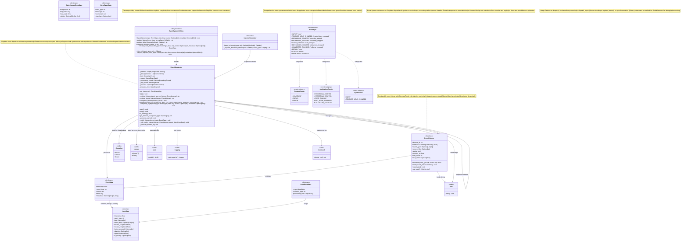

```mermaid
classDiagram
    %% Event Types Enumeration
    class EventType {
        <<enumeration>>
        +INPUT: "input"
        +TRACKED_KEYS_CHANGED: "tracked_keys_changed"
        +RECORDING_STARTED: "recording_started"
        +RECORDING_STOPPED: "recording_stopped"
        +STATE_CHANGE: "state_change"
        +EDIT_MODE_CHANGED: "edit_mode_changed"
        +COLLECTOR_CHANGED: "collector_changed"
        +ERROR: "error"
        +STATUS: "status"
        +HEARTBEAT: "heartbeat"
    }

    %% Event Data Structures
    class EventData {
        <<dictionary>>
        +timestamp: float
        +event_type: str
        +source: str
        +data: Any
        +metadata: Optional[Dict[str, Any]]
    }

    class InputEventData {
        <<dictionary>>
        +event: InputData
        +collector_type: str
        +processed_data: Dict[str, Any]
    }

    class StateChangeEventData {
        <<dictionary>>
        +component: str
        +old_state: Any
        +new_state: Any
        +details: Optional[Dict[str, Any]]
    }

    class ErrorEventData {
        <<dictionary>>
        +error_type: str
        +message: str
        +component: str
        +traceback: Optional[str]
    }

    %% Core Event System Components
    class EventDispatcher {
        -_listeners: Dict[str, List[EventListener]]
        -_global_listeners: List[EventListener]
        -_lock: threading.RLock
        -_queue: Queue[EventData]
        -_processing_thread: Optional[threading.Thread]
        -_stop_event: threading.Event
        -_instance: Optional[EventDispatcher]
        -_instance_lock: threading.Lock

        +get_instance()$ EventDispatcher
        +__init__() void
        +register_listener(event_type: str, listener: EventListener) str
        +register_global_listener(listener: EventListener) str
        +unregister_listener(listener_id: str) bool
        +dispatch(event_type: EventType, data: Any, source: Optional[str], metadata: Optional[Dict]) void
        +dispatch_async(event_type: EventType, data: Any, source: Optional[str], metadata: Optional[Dict]) void
        +start() void
        +stop() void
        +is_running() bool
        +get_listener_count(event_type: Optional[str]) int
        -_process_events() void
        -_notify_listeners(event_data: EventData) void
        -_safe_notify_listener(listener: EventListener, event_data: EventData) void
        -_generate_listener_id() str
    }

    class EventListener {
        <<dataclass>>
        +listener_id: str
        +callback: Callable[[EventData], None]
        +event_types: Optional[List[str]]
        +source_filter: Optional[str]
        +active: bool
        +created_at: float
        +call_count: int
        +last_called: Optional[float]

        +matches(event_type: str, source: str) bool
        +notify(event_data: EventData) void
        +deactivate() void
        +get_stats() Dict[str, Any]
    }

    %% Utility Functions and Decorators
    class EventSystemUtilities {
        <<utility functions>>
        +dispatch(event_type: EventType, data: Any, source: Optional[str], metadata: Optional[Dict]) void
        +register_listener(event_type: str, callback: Callable) str
        +register_global_listener(callback: Callable) str
        +unregister_listener(listener_id: str) bool
        +create_event_data(event_type: EventType, data: Any, source: Optional[str], metadata: Optional[Dict]) EventData
        +listen_to(*event_types: str) Callable
        +async_dispatch(event_type: EventType, data: Any, source: Optional[str], metadata: Optional[Dict]) void
    }

    class ListenerDecorator {
        <<decorator>>
        +listen_to(*event_types: str) Callable[[Callable], Callable]
        +_register_decorated_listener(func: Callable, event_types: List[str]) str
    }

    %% External Dependencies
    class InputData {
        <<external>>
        +timestamp: float
        +event_type: str
        +key: Optional[str]
        +active_keys: Optional[List[str]]
        +mouse_x: Optional[float]
        +mouse_y: Optional[float]
        +button_pressed: Optional[str]
        +direction: Optional[str]
        +speed: Optional[float]
        +is_moving: Optional[bool]
    }

    %% Standard Library Dependencies
    class threading {
        <<stdlib>>
        +RLock
        +Thread
        +Event
    }

    class queue {
        <<stdlib>>
        +Queue[T]
        +Empty
    }

    class time {
        <<stdlib>>
        +time() float
    }

    class uuid {
        <<stdlib>>
        +uuid4() UUID
    }

    class logging {
        <<stdlib>>
        +getLogger(str) Logger
    }

    class traceback {
        <<stdlib>>
        +format_exc() str
    }

    %% Event Categories
    class SystemEvents {
        <<event category>>
        +HEARTBEAT
        +STATUS
        +ERROR
    }

    class ApplicationEvents {
        <<event category>>
        +RECORDING_STARTED
        +RECORDING_STOPPED
        +STATE_CHANGE
        +EDIT_MODE_CHANGED
        +COLLECTOR_CHANGED
    }

    class InputEvents {
        <<event category>>
        +INPUT
        +TRACKED_KEYS_CHANGED
    }

    %% Relationships
    EventDispatcher "1" --> "*" EventListener : manages
    EventDispatcher --> EventData : processes
    EventDispatcher --> threading : uses for thread safety
    EventDispatcher --> queue : uses for async processing

    EventListener --> EventData : receives
    EventListener --> time : tracks timing

    EventSystemUtilities --> EventDispatcher : facade
    ListenerDecorator --> EventDispatcher : registers listeners

    EventData --> InputData : contains (for input events)
    InputEventData --> InputData : wraps

    EventType ..> SystemEvents : categorizes
    EventType ..> ApplicationEvents : categorizes
    EventType ..> InputEvents : categorizes

    EventDispatcher --> logging : logs errors
    EventDispatcher --> traceback : captures errors
    EventDispatcher --> uuid : generates IDs
    EventDispatcher --> time : timestamps

    %% Singleton Pattern
    EventDispatcher --|> EventDispatcher : singleton instance

    %% Notes
    note for EventDispatcher "Singleton event dispatcher with async processing\nThread-safe event queuing and delivery\nSupports both synchronous and asynchronous dispatch\nAutomatic error handling and listener isolation"

    note for EventListener "Configurable event listener with filtering\nTracks call statistics and timing\nSupports source-based filtering\nCan be activated/deactivated dynamically"

    note for EventSystemUtilities "Facade providing simple API functions\nHides singleton complexity from consumers\nProvides decorator support for listeners\nSimplifies common event operations"

    note for EventType "Comprehensive event type enumeration\nCovers all application event categories\nExtensible for future event types\nProvides standard event naming"

    %% Architecture Documentation
    note "Event System Architecture:\n• Singleton dispatcher for global access\n• Async processing via background thread\n• Thread-safe queue for event buffering\n• Listener filtering and statistics\n• Error isolation and logging\n• Decorator-based listener registration"

    %% Usage Patterns
    note "Usage Patterns:\n• dispatch() for immediate processing\n• dispatch_async() for non-blocking\n• register_listener() for specific events\n• @listen_to decorator for methods\n• Global listeners for debugging/monitoring"
```
