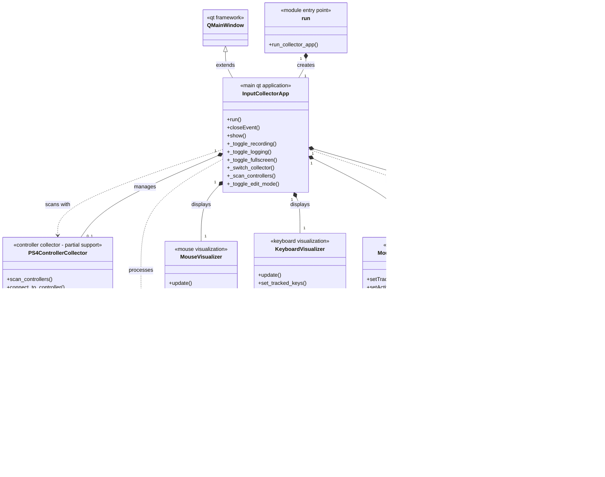

```mermaid
classDiagram
    direction TB
    
    %% Main Application Entry Point
    class run {
        <<module entry point>>
        +run_collector_app()
    }
    
    class InputCollectorApp {
        <<main qt application>>
        +run()
        +closeEvent()
        +show()
        +_toggle_recording()
        +_toggle_logging()
        +_toggle_fullscreen()
        +_switch_collector()
        +_scan_controllers()
        +_toggle_edit_mode()
    }
    
    %% Core Components
    class KeyboardMouseCollector {
        <<primary collector>>
        +start_capture()
        +stop_capture()
        +get_input_event()
        +get_active_keys()
        +set_supported_keys()
        +on_event()
        +set_mouse_tracking_mode()
        +set_joystick_sensitivity()
    }
    
    class PS4ControllerCollector {
        <<controller collector - partial support>>
        +scan_controllers()
        +connect_to_controller()
        +find_ps4_controller()
    }
    
    %% Visualizers
    class KeyboardVisualizer {
        <<keyboard visualization>>
        +update()
        +set_tracked_keys()
        +get_key_at_position()
        +force_update()
    }
    
    class MouseVisualizer {
        <<mouse visualization>>
        +update()
        +force_update()
    }
    
    class MouseButtonsSelector {
        <<mouse buttons ui>>
        +setTrackedButtons()
        +setActiveButtons()
        +setEditMode()
    }
    
    %% Data Structures
    class InputData {
        <<data structure>>
        +timestamp: float
        +event_type: str
        +key: str
        +mouse_x: float
        +mouse_y: float
        +active_keys: List[str]
        +direction: str
        +speed: float
        +rel_x: float
        +rel_y: float
    }
    
    class AbstractInputCollector {
        <<abstract interface>>
        +start_capture()*
        +stop_capture()*
        +get_input_event()*
        +on_event()*
        +set_supported_keys()*
    }
    
    %% External Framework Components
    class QMainWindow {
        <<qt framework>>
    }
    
    class pynput {
        <<input framework>>
    }
    
    class SDL2 {
        <<controller framework>>
    }
    
    %% Entry Point
    run "1" *-- "1" InputCollectorApp : creates
    
    %% Main Architecture
    QMainWindow <|-- InputCollectorApp : extends
    AbstractInputCollector <|-- KeyboardMouseCollector : implements
    
    InputCollectorApp "1" *-- "1" KeyboardMouseCollector : manages
    InputCollectorApp "1" *-- "0..1" PS4ControllerCollector : manages
    InputCollectorApp "1" *-- "1" KeyboardVisualizer : displays
    InputCollectorApp "1" *-- "1" MouseVisualizer : displays
    InputCollectorApp "1" *-- "1" MouseButtonsSelector : includes
    
    %% Data Flow
    KeyboardMouseCollector "1" *-- "*" InputData : generates
    KeyboardVisualizer ..> InputData : visualizes
    MouseVisualizer ..> InputData : visualizes
    
    %% Framework Dependencies
    KeyboardMouseCollector ..> pynput : uses
    PS4ControllerCollector ..> SDL2 : uses
    InputCollectorApp ..> InputData : processes
    
    %% Collector Selection
    InputCollectorApp ..> KeyboardMouseCollector : switches to
    InputCollectorApp ..> PS4ControllerCollector : scans with
```