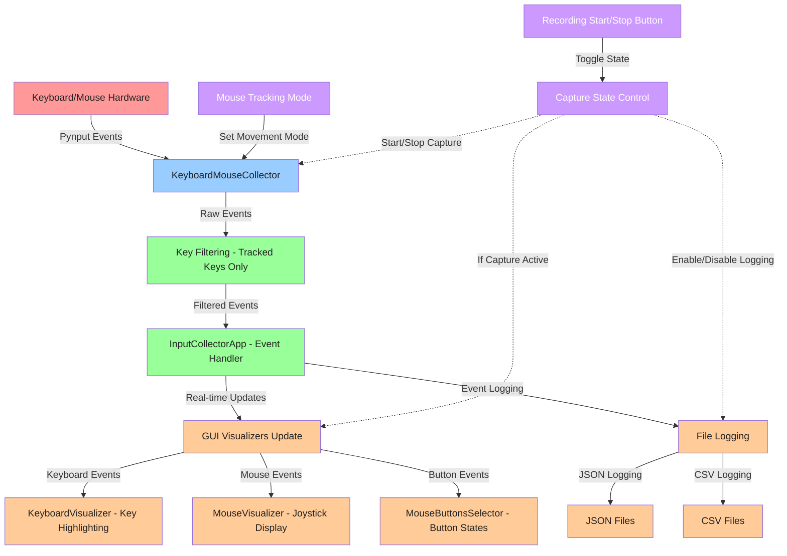

```mermaid
flowchart TD
    %% Hardware Input Sources
    A[Keyboard/Mouse Hardware] -->|Pynput Events| B[KeyboardMouseCollector]
    
    %% Event Processing
    B -->|Raw Events| C[Key Filtering - Tracked Keys Only]
    C -->|Filtered Events| D[InputCollectorApp - Event Handler]
    
    %% Event Distribution
    D -->|Real-time Updates| E[GUI Visualizers Update]
    D -->|Event Logging| F[File Logging]
    
    %% GUI Visualization
    E -->|Keyboard Events| G[KeyboardVisualizer - Key Highlighting]
    E -->|Mouse Events| H[MouseVisualizer - Joystick Display]
    E -->|Button Events| I[MouseButtonsSelector - Button States]
    
    %% File Output
    F -->|JSON Logging| J[JSON Files]
    F -->|CSV Logging| K[CSV Files]
    
    %% User Controls
    L[Recording Start/Stop Button] -->|Toggle State| M[Capture State Control]
    O[Mouse Tracking Mode] -->|Set Movement Mode| B
    
    %% Capture State Management
    M -.->|Start/Stop Capture| B
    M -.->|Enable/Disable Logging| F
    M -.->|If Capture Active| E
    
    %% Styling
    classDef hardware fill:#ff9999,color:#222
    classDef collection fill:#99ccff,color:#222
    classDef processing fill:#99ff99,color:#222
    classDef output fill:#ffcc99,color:#222
    classDef control fill:#cc99ff,color:#fff
    
    class A hardware
    class B collection
    class C,D processing
    class E,F,G,H,I,J,K output
    class L,M,O control
```