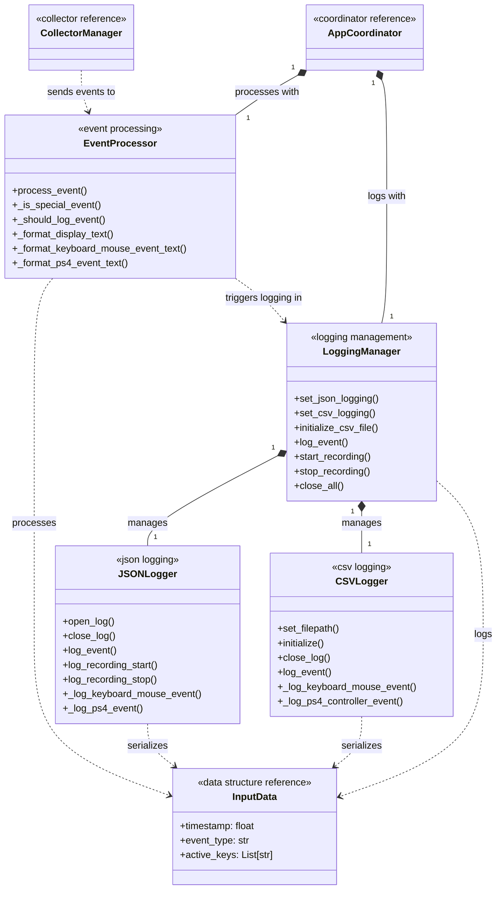

```mermaid
classDiagram
    direction TB
    
    %% Processing Layer
    class EventProcessor {
        <<event processing>>
        +process_event()
        +_is_special_event()
        +_should_log_event()
        +_format_display_text()
        +_format_keyboard_mouse_event_text()
        +_format_ps4_event_text()
    }
    
    %% Logging Management Layer
    class LoggingManager {
        <<logging management>>
        +set_json_logging()
        +set_csv_logging()
        +initialize_csv_file()
        +log_event()
        +start_recording()
        +stop_recording()
        +close_all()
    }
    
    %% Concrete Loggers
    class JSONLogger {
        <<json logging>>
        +open_log()
        +close_log()
        +log_event()
        +log_recording_start()
        +log_recording_stop()
        +_log_keyboard_mouse_event()
        +_log_ps4_event()
    }
    
    class CSVLogger {
        <<csv logging>>
        +set_filepath()
        +initialize()
        +close_log()
        +log_event()
        +_log_keyboard_mouse_event()
        +_log_ps4_controller_event()
    }
    
    %% Data Structure (reference from main diagram)
    class InputData {
        <<data structure reference>>
        +timestamp: float
        +event_type: str
        +active_keys: List[str]
    }
    
    %% Main App Components (references)
    class AppCoordinator {
        <<coordinator reference>>
    }
    
    class CollectorManager {
        <<collector reference>>
    }
    
    %% Logging Architecture
    LoggingManager "1" *-- "1" JSONLogger : manages
    LoggingManager "1" *-- "1" CSVLogger : manages
    
    %% Processing Integration

    CollectorManager ..> EventProcessor : sends events to

    AppCoordinator "1" *-- "1" EventProcessor : processes with
    AppCoordinator "1" *-- "1" LoggingManager : logs with
    
    %% Event Flow
    EventProcessor ..> InputData : processes
    LoggingManager ..> InputData : logs
    JSONLogger ..> InputData : serializes
    CSVLogger ..> InputData : serializes
    
    %% Cross-component Dependencies
    
    EventProcessor ..> LoggingManager : triggers logging in
```