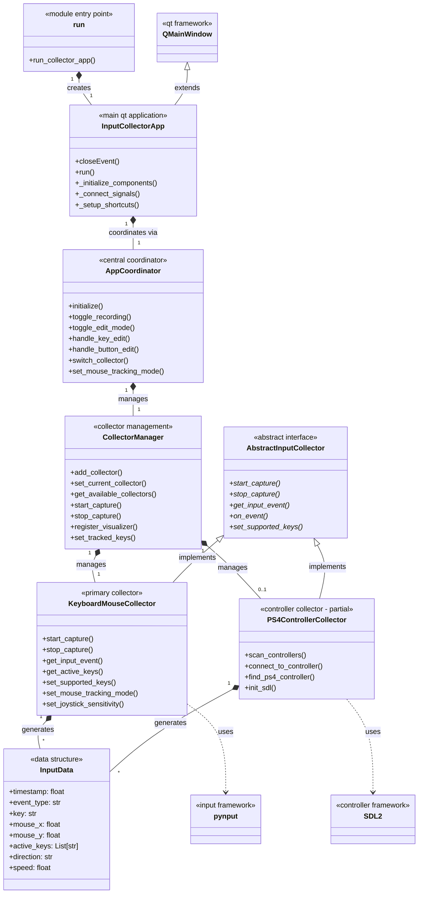

```mermaid
classDiagram
    direction TB
    
    %% Main Application Entry Point
    class run {
        <<module entry point>>
        +run_collector_app()
    }
    
    class InputCollectorApp {
        <<main qt application>>
        +closeEvent()
        +run()
        +_initialize_components()
        +_connect_signals()
        +_setup_shortcuts()
    }
    
    %% Core Coordination Layer
    class AppCoordinator {
        <<central coordinator>>
        +initialize()
        +toggle_recording()
        +toggle_edit_mode()
        +handle_key_edit()
        +handle_button_edit()
        +switch_collector()
        +set_mouse_tracking_mode()
    }
    
    %% Collector Management Layer
    class CollectorManager {
        <<collector management>>
        +add_collector()
        +set_current_collector()
        +get_available_collectors()
        +start_capture()
        +stop_capture()
        +register_visualizer()
        +set_tracked_keys()
    }
    
    %% Core Collectors
    class KeyboardMouseCollector {
        <<primary collector>>
        +start_capture()
        +stop_capture()
        +get_input_event()
        +get_active_keys()
        +set_supported_keys()
        +set_mouse_tracking_mode()
        +set_joystick_sensitivity()
    }
    
    class PS4ControllerCollector {
        <<controller collector - partial>>
        +scan_controllers()
        +connect_to_controller()
        +find_ps4_controller()
        +init_sdl()
    }
    
    %% Interfaces
    class AbstractInputCollector {
        <<abstract interface>>
        +start_capture()*
        +stop_capture()*
        +get_input_event()*
        +on_event()*
        +set_supported_keys()*
    }
    
    %% Data Structure
    class InputData {
        <<data structure>>
        +timestamp: float
        +event_type: str
        +key: str
        +mouse_x: float
        +mouse_y: float
        +active_keys: List[str]
        +direction: str
        +speed: float
    }
    
    %% External Framework
    class QMainWindow {
        <<qt framework>>
    }
    
    class pynput {
        <<input framework>>
    }
    
    class SDL2 {
        <<controller framework>>
    }
    
    %% Entry Point
    run "1" *-- "1" InputCollectorApp : creates
    
    %% Main Architecture
    QMainWindow <|-- InputCollectorApp : extends
    
    %% Component Management
    InputCollectorApp "1" *-- "1" AppCoordinator : coordinates via
    AppCoordinator "1" *-- "1" CollectorManager : manages
    
    %% Collector Management
    CollectorManager "1" *-- "1" KeyboardMouseCollector : manages
    CollectorManager "1" *-- "0..1" PS4ControllerCollector : manages
    
    %% Interface Implementation
    AbstractInputCollector <|-- KeyboardMouseCollector : implements
    AbstractInputCollector <|-- PS4ControllerCollector : implements
    
    %% Data Flow
    KeyboardMouseCollector "1" *-- "*" InputData : generates
    PS4ControllerCollector "1" *-- "*" InputData : generates
    
    %% Framework Dependencies
    KeyboardMouseCollector ..> pynput : uses
    PS4ControllerCollector ..> SDL2 : uses
```