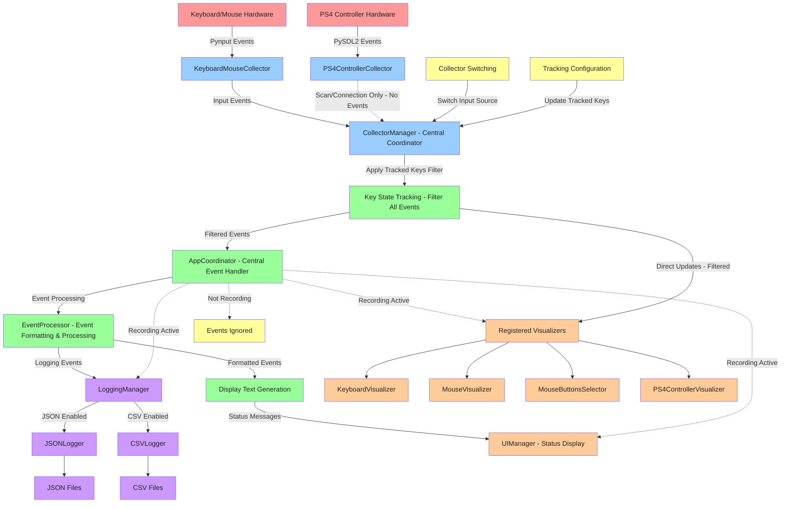

```mermaid
flowchart TD
    %% Hardware Input Sources
    A[Keyboard/Mouse Hardware] -->|Pynput Events| B[KeyboardMouseCollector]
    A2[PS4 Controller Hardware] -->|PySDL2 Events| B2[PS4ControllerCollector]
    
    %% Collection Management Layer
    B -->|Input Events| C[CollectorManager - Central Coordinator]
    B2 -.->|Scan/Connection Only - No Events| C
    
    %% Key Filtering Layer
    C -->|Apply Tracked Keys Filter| O[Key State Tracking - Filter All Events]
    
    %% Event Processing and Coordination
    O -->|Filtered Events| D[AppCoordinator - Central Event Handler]
    D -->|Event Processing| E[EventProcessor - Event Formatting & Processing]
    
    %% AppCoordinator Distribution
    E -->|Formatted Events| F[Display Text Generation]
    E -->|Logging Events| G[LoggingManager]
    
    %% Visualization Branch - Direct from CollectorManager
    D -.->|Recording Active| H[Registered Visualizers]
    O -->|Direct Updates - Filtered| H
    H --> I1[KeyboardVisualizer]
    H --> I2[MouseVisualizer] 
    H --> I3[MouseButtonsSelector]
    H --> I4[PS4ControllerVisualizer]
    
    %% Logging Branch
    G -->|JSON Enabled| J1[JSONLogger]
    G -->|CSV Enabled| J2[CSVLogger]
    J1 --> K1[JSON Files]
    J2 --> K2[CSV Files]
    
    %% UI Display Branch
    F -->|Status Messages| L[UIManager - Status Display]
    D -.->|Recording Active| L
    
    %% User Controls
    M1[Collector Switching] -->|Switch Input Source| C
    M2[Tracking Configuration] -->|Update Tracked Keys| C
    
    %% Recording State Control
    D -.->|Recording Active| G
    
    D -.->|Not Recording| P[Events Ignored]
    
    %% Styling
    classDef hardware fill:#ff9999,color:#222
    classDef collection fill:#99ccff,color:#222
    classDef processing fill:#99ff99,color:#222
    classDef visualization fill:#ffcc99,color:#222
    classDef output fill:#cc99ff,color:#222
    classDef control fill:#ffff99,color:#222
    
    class A,A2 hardware
    class B,B2,C collection
    class D,E,F,O processing
    class H,I1,I2,I3,I4,L visualization
    class G,J1,J2,K1,K2 output
    class M1,M2,P control
```