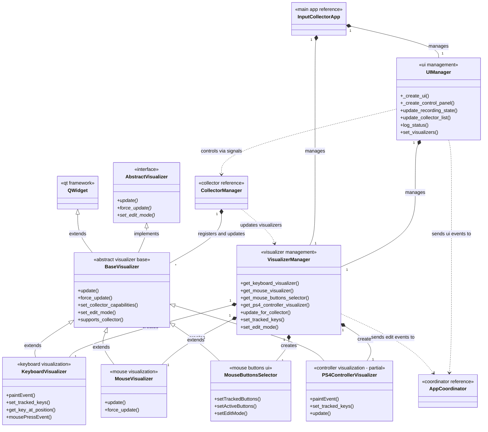

```mermaid
classDiagram
    direction TB
    
    %% UI Management Layer
    class UIManager {
        <<ui management>>
        +_create_ui()
        +_create_control_panel()
        +update_recording_state()
        +update_collector_list()
        +log_status()
        +set_visualizers()
    }
    
    class VisualizerManager {
        <<visualizer management>>
        +get_keyboard_visualizer()
        +get_mouse_visualizer()
        +get_mouse_buttons_selector()
        +get_ps4_controller_visualizer()
        +update_for_collector()
        +set_tracked_keys()
        +set_edit_mode()
    }
    
    %% Base Visualizer Classes
    class BaseVisualizer {
        <<abstract visualizer base>>
        +update()
        +force_update()
        +set_collector_capabilities()
        +set_edit_mode()
        +supports_collector()
    }
    
    %% Concrete Visualizers
    class KeyboardVisualizer {
        <<keyboard visualization>>
        +paintEvent()
        +set_tracked_keys()
        +get_key_at_position()
        +mousePressEvent()
    }
    
    class MouseVisualizer {
        <<mouse visualization>>
        +update()
        +force_update()
    }
    
    class MouseButtonsSelector {
        <<mouse buttons ui>>
        +setTrackedButtons()
        +setActiveButtons()
        +setEditMode()
    }
    
    class PS4ControllerVisualizer {
        <<controller visualization - partial>>
        +paintEvent()
        +set_tracked_keys()
        +update()
    }
    
    %% Single Essential Interface
    class AbstractVisualizer {
        <<interface>>
        +update()*
        +force_update()*
        +set_edit_mode()*
    }
    
    %% References to Core Components (from main diagram)
    class AppCoordinator {
        <<coordinator reference>>
    }
    
    class CollectorManager {
        <<collector reference>>
    }
    
    class InputCollectorApp {
        <<main app reference>>
    }
    
    %% External Qt Framework
    class QWidget {
        <<qt framework>>
    }
    
    %% UI Architecture
    UIManager "1" *-- "1" VisualizerManager : manages
    
    %% Visualizer Management
    VisualizerManager "1" *-- "1" KeyboardVisualizer : creates
    VisualizerManager "1" *-- "1" MouseVisualizer : creates
    VisualizerManager "1" *-- "1" MouseButtonsSelector : creates
    VisualizerManager "1" *-- "1" PS4ControllerVisualizer : creates
    
    %% Visualizer Inheritance
    
    BaseVisualizer <|-- KeyboardVisualizer : extends
    BaseVisualizer <|-- MouseVisualizer : extends
    BaseVisualizer <|-- MouseButtonsSelector : extends
    BaseVisualizer <|-- PS4ControllerVisualizer : extends
    
    
    %% Main App Integration
    InputCollectorApp "1" *-- "1" UIManager : manages
    InputCollectorApp "1" *-- "1" VisualizerManager : manages
    
    %% UI to Core Connections
    UIManager ..> CollectorManager : controls via signals
    UIManager ..> AppCoordinator : sends ui events to
    
    %% Visualizer to Core Connections  
    VisualizerManager ..> AppCoordinator : sends edit events to
    CollectorManager ..> VisualizerManager : updates visualizers
    
    %% Visualizer Registration
    CollectorManager "1" *-- "*" BaseVisualizer : registers and updates

    AbstractVisualizer <|-- BaseVisualizer : implements

    QWidget <|-- BaseVisualizer : extends
```