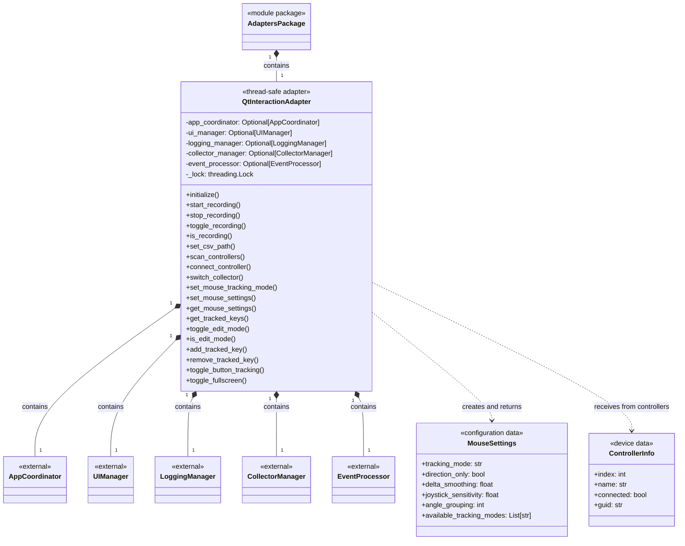

```mermaid
classDiagram
    direction TB
    
    %% Main Adapter Class
    class QtInteractionAdapter {
        <<thread-safe adapter>>
        -app_coordinator: Optional[AppCoordinator]
        -ui_manager: Optional[UIManager]
        -logging_manager: Optional[LoggingManager]
        -collector_manager: Optional[CollectorManager]
        -event_processor: Optional[EventProcessor]
        -_lock: threading.Lock
        +initialize()
        +start_recording()
        +stop_recording()
        +toggle_recording()
        +is_recording()
        +set_csv_path()
        +scan_controllers()
        +connect_controller()
        +switch_collector()
        +set_mouse_tracking_mode()
        +set_mouse_settings()
        +get_mouse_settings()
        +get_tracked_keys()
        +toggle_edit_mode()
        +is_edit_mode()
        +add_tracked_key()
        +remove_tracked_key()
        +toggle_button_tracking()
        +toggle_fullscreen()
    }
    
    %% External Component Dependencies (References)
    class AppCoordinator {
        <<external>>
    }
    
    class UIManager {
        <<external>>
    }
    
    class LoggingManager {
        <<external>>
    }
    
    class CollectorManager {
        <<external>>
    }
    
    class EventProcessor {
        <<external>>
    }
    
    %% Configuration Data Structures
    class MouseSettings {
        <<configuration data>>
        +tracking_mode: str
        +direction_only: bool
        +delta_smoothing: float
        +joystick_sensitivity: float
        +angle_grouping: int
        +available_tracking_modes: List[str]
    }
    
    class ControllerInfo {
        <<device data>>
        +index: int
        +name: str
        +connected: bool
        +guid: str
    }
    
    %% Package Reference
    class AdaptersPackage {
        <<module package>>
    }
    
    %% Package Composition
    AdaptersPackage "1" *-- "1" QtInteractionAdapter : contains
    
    %% Core Component Dependencies
    QtInteractionAdapter "1" *-- "1" AppCoordinator : contains
    QtInteractionAdapter "1" *-- "1" UIManager : contains
    QtInteractionAdapter "1" *-- "1" LoggingManager : contains
    QtInteractionAdapter "1" *-- "1" CollectorManager : contains
    QtInteractionAdapter "1" *-- "1" EventProcessor : contains
    
    %% Data Structure Usage
    QtInteractionAdapter ..> MouseSettings : creates and returns
    QtInteractionAdapter ..> ControllerInfo : receives from controllers
```