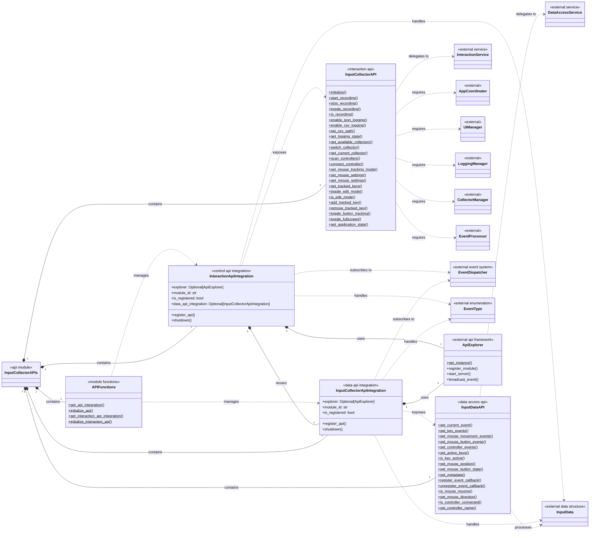

```mermaid
classDiagram
    direction LR
    
    %% Main APIs
    class InputCollectorAPI {
        <<interaction api>>
        +initialize()$
        +start_recording()$
        +stop_recording()$
        +toggle_recording()$
        +is_recording()$
        +enable_json_logging()$
        +enable_csv_logging()$
        +set_csv_path()$
        +get_logging_state()$
        +get_available_collectors()$
        +switch_collector()$
        +get_current_collector()$
        +scan_controllers()$
        +connect_controller()$
        +set_mouse_tracking_mode()$
        +set_mouse_settings()$
        +get_mouse_settings()$
        +get_tracked_keys()$
        +toggle_edit_mode()$
        +is_edit_mode()$
        +add_tracked_key()$
        +remove_tracked_key()$
        +toggle_button_tracking()$
        +toggle_fullscreen()$
        +get_application_state()$
    }
    
    class InputDataAPI {
        <<data access api>>
        +get_current_event()$
        +get_key_events()$
        +get_mouse_movement_events()$
        +get_mouse_button_events()$
        +get_controller_events()$
        +get_active_keys()$
        +is_key_active()$
        +get_mouse_position()$
        +get_mouse_button_state()$
        +get_metadata()$
        +register_event_callback()$
        +unregister_event_callback()$
        +is_mouse_moving()$
        +get_mouse_direction()$
        +is_controller_connected()$
        +get_controller_name()$
    }
    
    %% API Integration Classes
    class InputCollectorApiIntegration {
        <<data api integration>>
        +explorer: Optional[ApiExplorer]
        +module_id: str
        +is_registered: bool
        +register_api()
        +shutdown()
    }
    
    class InteractionApiIntegration {
        <<control api integration>>
        +explorer: Optional[ApiExplorer]
        +module_id: str
        +is_registered: bool
        +data_api_integration: Optional[InputCollectorApiIntegration]
        +register_api()
        +shutdown()
    }
    
    %% API Integration Functions
    class APIFunctions {
        <<module functions>>
        +get_api_integration()$
        +initialize_api()$
        +get_interaction_api_integration()$
        +initialize_interaction_api()$
    }
    
    %% External Services (References)
    class InteractionService {
        <<external service>>
    }
    
    class DataAccessService {
        <<external service>>
    }
    
    class AppCoordinator {
        <<external>>
    }
    
    class UIManager {
        <<external>>
    }
    
    class LoggingManager {
        <<external>>
    }
    
    class CollectorManager {
        <<external>>
    }
    
    class EventProcessor {
        <<external>>
    }
    
    %% Data Structure (Reference)
    class InputData {
        <<external data structure>>
    }
    
    %% Event System (Reference)
    class EventDispatcher {
        <<external event system>>
    }
    
    class EventType {
        <<external enumeration>>
    }
    
    %% External API Framework
    class ApiExplorer {
        <<external api framework>>
        +get_instance()$
        +register_module()
        +start_server()
        +broadcast_event()
    }
    
    %% Package Reference
    class InputCollectorAPIs {
        <<api module>>
    }
    
    %% Package Composition
    InputCollectorAPIs "1" *-- "1" InputCollectorAPI : contains
    InputCollectorAPIs "1" *-- "1" InputDataAPI : contains
    InputCollectorAPIs "1" *-- "1" InputCollectorApiIntegration : contains
    InputCollectorAPIs "1" *-- "1" InteractionApiIntegration : contains
    InputCollectorAPIs "1" *-- "1" APIFunctions : contains
    
    %% API Delegation
    InputCollectorAPI ..> InteractionService : delegates to
    InputDataAPI ..> DataAccessService : delegates to
    
    %% API Integration Relationships
    InputCollectorApiIntegration "1" *-- "1" ApiExplorer : uses
    InteractionApiIntegration "1" *-- "1" ApiExplorer : uses
    InteractionApiIntegration "1" *-- "1" InputCollectorApiIntegration : reuses
    
    %% API Exposure
    InputCollectorApiIntegration ..> InputDataAPI : exposes
    InteractionApiIntegration ..> InputCollectorAPI : exposes
    
    %% Initialization Dependencies
    InputCollectorAPI ..> AppCoordinator : requires
    InputCollectorAPI ..> UIManager : requires
    InputCollectorAPI ..> LoggingManager : requires
    InputCollectorAPI ..> CollectorManager : requires
    InputCollectorAPI ..> EventProcessor : requires
    
    %% Data Processing
    InputDataAPI ..> InputData : processes
    InputCollectorApiIntegration ..> InputData : handles
    InteractionApiIntegration ..> InputData : handles
    
    %% Event System Integration
    InputCollectorApiIntegration ..> EventDispatcher : subscribes to
    InteractionApiIntegration ..> EventDispatcher : subscribes to
    InputCollectorApiIntegration ..> EventType : handles
    InteractionApiIntegration ..> EventType : handles
    
    %% Function Integration
    APIFunctions ..> InputCollectorApiIntegration : manages
    APIFunctions ..> InteractionApiIntegration : manages
```