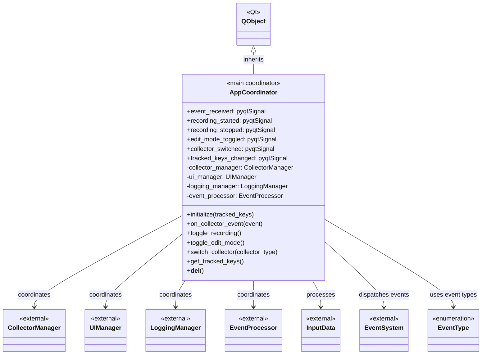

```mermaid
classDiagram
    direction TB

    %% Main Application Coordinator
    class AppCoordinator {
        <<main coordinator>>
        +event_received: pyqtSignal
        +recording_started: pyqtSignal
        +recording_stopped: pyqtSignal
        +edit_mode_toggled: pyqtSignal
        +collector_switched: pyqtSignal
        +tracked_keys_changed: pyqtSignal

        -collector_manager: CollectorManager
        -ui_manager: UIManager
        -logging_manager: LoggingManager
        -event_processor: EventProcessor

        +initialize(tracked_keys)
        +on_collector_event(event)
        +toggle_recording()
        +toggle_edit_mode()
        +switch_collector(collector_type)
        +get_tracked_keys()
        +__del__()
    }

    %% External Dependencies (references only, no attributes/methods)
    class CollectorManager {
        <<external>>
    }

    class UIManager {
        <<external>>
    }

    class LoggingManager {
        <<external>>
    }

    class EventProcessor {
        <<external>>
    }

    class InputData {
        <<external>>
    }

    class EventSystem {
        <<external>>
    }

    class EventType {
        <<enumeration>>
    }

    %% Qt Base Class (reference only)
    class QObject {
        <<Qt>>
    }

    %% Relationships
    QObject <|-- AppCoordinator : inherits

    AppCoordinator --> CollectorManager : coordinates
    AppCoordinator --> UIManager : coordinates
    AppCoordinator --> LoggingManager : coordinates
    AppCoordinator --> EventProcessor : coordinates

    AppCoordinator --> InputData : processes
    AppCoordinator --> EventSystem : dispatches events
    AppCoordinator --> EventType : uses event types
```