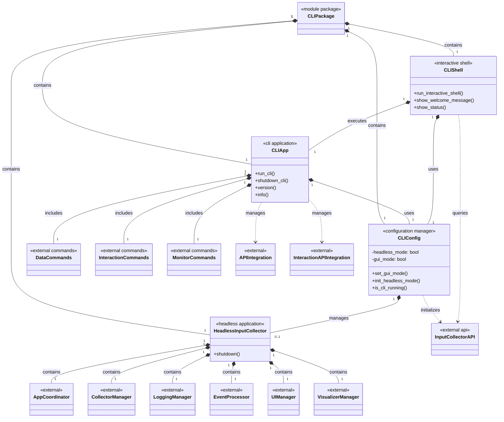

```mermaid
classDiagram
    direction TB
    
    %% Main CLI Components
    class CLIApp {
        <<cli application>>
        +run_cli()
        +shutdown_cli()
        +version()
        +info()
    }
    
    class CLIShell {
        <<interactive shell>>
        +run_interactive_shell()
        +show_welcome_message()
        +show_status()
    }
    
    class CLIConfig {
        <<configuration manager>>
        -headless_mode: bool
        -gui_mode: bool
        +set_gui_mode()
        +init_headless_mode()
        +is_cli_running()
    }
    
    class HeadlessInputCollector {
        <<headless application>>
        +shutdown()
    }
    
    %% Command Modules (External References)
    class DataCommands {
        <<external commands>>
    }
    
    class InteractionCommands {
        <<external commands>>
    }
    
    class MonitorCommands {
        <<external commands>>
    }
    
    %% Core Components (External References)
    class AppCoordinator {
        <<external>>
    }
    
    class CollectorManager {
        <<external>>
    }
    
    class LoggingManager {
        <<external>>
    }
    
    class EventProcessor {
        <<external>>
    }
    
    class UIManager {
        <<external>>
    }
    
    class VisualizerManager {
        <<external>>
    }
    
    %% API Integration (External References)
    class InputCollectorAPI {
        <<external api>>
    }
    
    class APIIntegration {
        <<external>>
    }
    
    class InteractionAPIIntegration {
        <<external>>
    }
    
    %% Package Reference
    class CLIPackage {
        <<module package>>
    }
    
    %% Package Composition
    CLIPackage "1" *-- "1" CLIApp : contains
    CLIPackage "1" *-- "1" CLIShell : contains
    CLIPackage "1" *-- "1" CLIConfig : contains
    CLIPackage "1" *-- "1" HeadlessInputCollector : contains
    
    %% Core CLI Relationships
    CLIApp "1" *-- "1" CLIConfig : uses
    CLIApp "1" *-- "1" DataCommands : includes
    CLIApp "1" *-- "1" InteractionCommands : includes
    CLIApp "1" *-- "1" MonitorCommands : includes
    
    CLIShell "1" *-- "1" CLIConfig : uses
    CLIShell "1" *-- "1" CLIApp : executes
    
    CLIConfig "1" *-- "0..1" HeadlessInputCollector : manages
    
    %% Headless Component Composition
    HeadlessInputCollector "1" *-- "1" AppCoordinator : contains
    HeadlessInputCollector "1" *-- "1" CollectorManager : contains
    HeadlessInputCollector "1" *-- "1" LoggingManager : contains
    HeadlessInputCollector "1" *-- "1" EventProcessor : contains
    HeadlessInputCollector "1" *-- "1" UIManager : contains
    HeadlessInputCollector "1" *-- "1" VisualizerManager : contains
    
    %% API Integration
    CLIApp ..> APIIntegration : manages
    CLIApp ..> InteractionAPIIntegration : manages
    CLIConfig ..> InputCollectorAPI : initializes
    CLIShell ..> InputCollectorAPI : queries
```