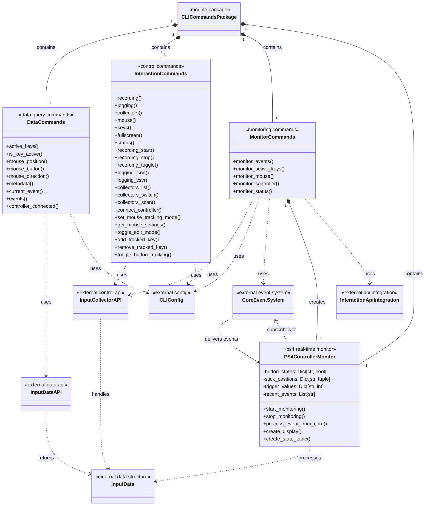

```mermaid
classDiagram
    direction TB
    
    %% Command Modules
    class DataCommands {
        <<data query commands>>
        +active_keys()
        +is_key_active()
        +mouse_position()
        +mouse_button()
        +mouse_direction()
        +metadata()
        +current_event()
        +events()
        +controller_connected()
    }
    
    class InteractionCommands {
        <<control commands>>
        +recording()
        +logging()
        +collectors()
        +mouse()
        +keys()
        +fullscreen()
        +status()
        +recording_start()
        +recording_stop()
        +recording_toggle()
        +logging_json()
        +logging_csv()
        +collectors_list()
        +collectors_switch()
        +collectors_scan()
        +connect_controller()
        +set_mouse_tracking_mode()
        +get_mouse_settings()
        +toggle_edit_mode()
        +add_tracked_key()
        +remove_tracked_key()
        +toggle_button_tracking()
    }
    
    class MonitorCommands {
        <<monitoring commands>>
        +monitor_events()
        +monitor_active_keys()
        +monitor_mouse()
        +monitor_controller()
        +monitor_status()
    }
    
    %% PS4 Controller Monitor
    class PS4ControllerMonitor {
        <<ps4 real-time monitor>>
        -button_states: Dict[str, bool]
        -stick_positions: Dict[str, tuple]
        -trigger_values: Dict[str, int]
        -recent_events: List[str]
        +start_monitoring()
        +stop_monitoring()
        +process_event_from_core()
        +create_display()
        +create_state_table()
    }
    
    %% External APIs (References)
    class InputDataAPI {
        <<external data api>>
    }
    
    class InputCollectorAPI {
        <<external control api>>
    }
    
    %% External Configuration (Reference)
    class CLIConfig {
        <<external config>>
    }
    
    %% External Event System (References)
    class CoreEventSystem {
        <<external event system>>
    }
    
    class InteractionApiIntegration {
        <<external api integration>>
    }
    
    %% Data Structures (References)
    class InputData {
        <<external data structure>>
    }
    
    %% Package Reference
    class CLICommandsPackage {
        <<module package>>
    }
    
    %% Package Composition
    CLICommandsPackage "1" *-- "1" DataCommands : contains
    CLICommandsPackage "1" *-- "1" InteractionCommands : contains
    CLICommandsPackage "1" *-- "1" MonitorCommands : contains
    CLICommandsPackage "1" *-- "1" PS4ControllerMonitor : contains
    
    %% Command Dependencies
    DataCommands ..> InputDataAPI : uses
    DataCommands ..> CLIConfig : uses
    
    InteractionCommands ..> InputCollectorAPI : uses
    InteractionCommands ..> CLIConfig : uses
    
    MonitorCommands ..> InputCollectorAPI : uses
    MonitorCommands ..> CLIConfig : uses
    MonitorCommands ..> CoreEventSystem : uses
    MonitorCommands "1" *-- "1" PS4ControllerMonitor : creates
    MonitorCommands ..> InteractionApiIntegration : uses
    
    %% PS4 Monitor Dependencies
    PS4ControllerMonitor ..> CoreEventSystem : subscribes to
    PS4ControllerMonitor ..> InputData : processes
    
    %% Event Flow
    CoreEventSystem ..> PS4ControllerMonitor : delivers events
    
    %% Data Processing
    InputDataAPI ..> InputData : returns
    InputCollectorAPI ..> InputData : handles
```