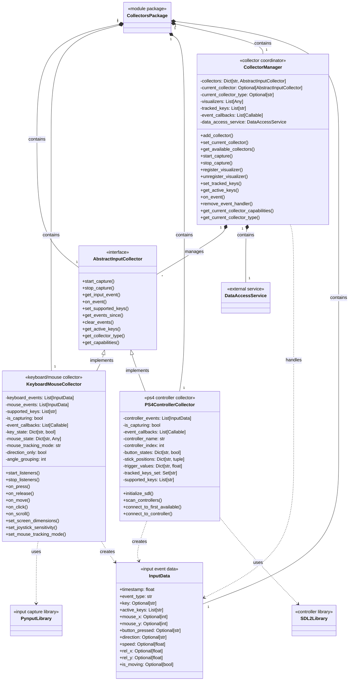

```mermaid
classDiagram
    direction TB
    
    %% Abstract Interface
    class AbstractInputCollector {
        <<interface>>
        +start_capture()
        +stop_capture()
        +get_input_event()
        +on_event()
        +set_supported_keys()
        +get_events_since()
        +clear_events()
        +get_active_keys()
        +get_collector_type()
        +get_capabilities()
    }
    
    %% Concrete Collectors
    class KeyboardMouseCollector {
        <<keyboard/mouse collector>>
        -keyboard_events: List[InputData]
        -mouse_events: List[InputData]
        -supported_keys: List[str]
        -is_capturing: bool
        -event_callbacks: List[Callable]
        -key_state: Dict[str, bool]
        -mouse_state: Dict[str, Any]
        -mouse_tracking_mode: str
        -direction_only: bool
        -angle_grouping: int
        +start_listeners()
        +stop_listeners()
        +on_press()
        +on_release()
        +on_move()
        +on_click()
        +on_scroll()
        +set_screen_dimensions()
        +set_joystick_sensitivity()
        +set_mouse_tracking_mode()
    }
    
    class PS4ControllerCollector {
        <<ps4 controller collector>>
        -controller_events: List[InputData]
        -is_capturing: bool
        -event_callbacks: List[Callable]
        -controller_name: str
        -controller_index: int
        -button_states: Dict[str, bool]
        -stick_positions: Dict[str, tuple]
        -trigger_values: Dict[str, float]
        -tracked_keys_set: Set[str]
        -supported_keys: List[str]
        +initialize_sdl()
        +scan_controllers()
        +connect_to_first_available()
        +connect_to_controller()
    }
    
    class CollectorManager {
        <<collector coordinator>>
        -collectors: Dict[str, AbstractInputCollector]
        -current_collector: Optional[AbstractInputCollector]
        -current_collector_type: Optional[str]
        -visualizers: List[Any]
        -tracked_keys: List[str]
        -event_callbacks: List[Callable]
        -data_access_service: DataAccessService
        +add_collector()
        +set_current_collector()
        +get_available_collectors()
        +start_capture()
        +stop_capture()
        +register_visualizer()
        +unregister_visualizer()
        +set_tracked_keys()
        +get_active_keys()
        +on_event()
        +remove_event_handler()
        +get_current_collector_capabilities()
        +get_current_collector_type()
    }
    
    %% Data Structures
    class InputData {
        <<input event data>>
        +timestamp: float
        +event_type: str
        +key: Optional[str]
        +active_keys: List[str]
        +mouse_x: Optional[int]
        +mouse_y: Optional[int]
        +button_pressed: Optional[str]
        +direction: Optional[str]
        +speed: Optional[float]
        +rel_x: Optional[float]
        +rel_y: Optional[float]
        +is_moving: Optional[bool]
    }
    
    %% External Services (References)
    class DataAccessService {
        <<external service>>
    }
    
    %% External Libraries (References)
    class PynputLibrary {
        <<input capture library>>
    }
    
    class SDL2Library {
        <<controller library>>
    }
    
    %% Package Reference
    class CollectorsPackage {
        <<module package>>
    }
    
    %% Package Composition
    CollectorsPackage "1" *-- "1" AbstractInputCollector : contains
    CollectorsPackage "1" *-- "1" KeyboardMouseCollector : contains
    CollectorsPackage "1" *-- "1" PS4ControllerCollector : contains
    CollectorsPackage "1" *-- "1" CollectorManager : contains
    CollectorsPackage "1" *-- "1" InputData : contains
    
    %% Inheritance
    AbstractInputCollector <|-- KeyboardMouseCollector : implements
    AbstractInputCollector <|-- PS4ControllerCollector : implements
    
    %% Manager Relationships
    CollectorManager "1" *-- "*" AbstractInputCollector : manages
    CollectorManager "1" *-- "1" DataAccessService : contains
    
    %% Data Flow
    KeyboardMouseCollector ..> PynputLibrary : uses
    
    KeyboardMouseCollector ..> InputData : creates
    PS4ControllerCollector ..> InputData : creates
    CollectorManager ..> InputData : handles
    
    %% External Dependencies
    PS4ControllerCollector ..> SDL2Library : uses
```