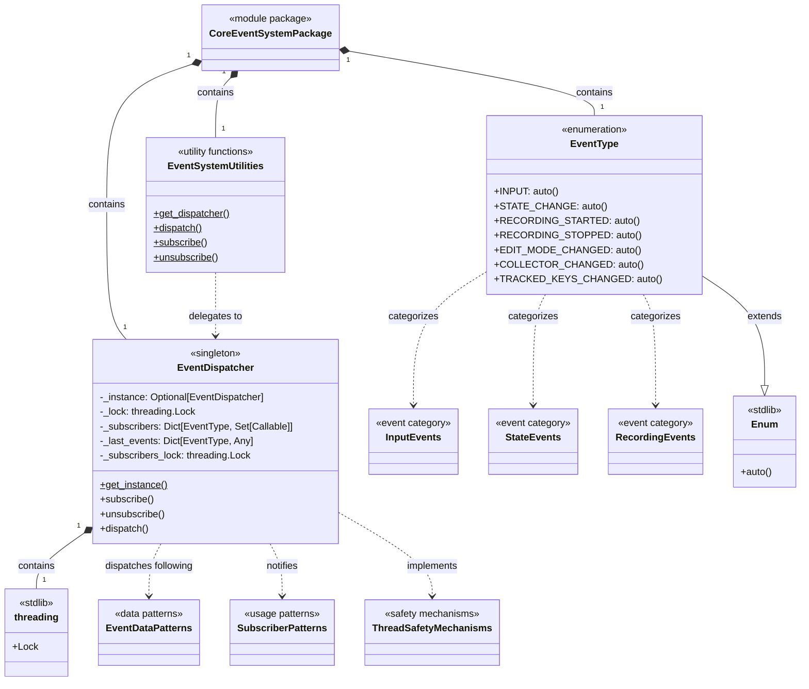

```mermaid
classDiagram
    direction TB
    
    %% Core Event System Components
    class EventType {
        <<enumeration>>
        +INPUT: auto()
        +STATE_CHANGE: auto()
        +RECORDING_STARTED: auto()
        +RECORDING_STOPPED: auto()
        +EDIT_MODE_CHANGED: auto()
        +COLLECTOR_CHANGED: auto()
        +TRACKED_KEYS_CHANGED: auto()
    }
    
    class EventDispatcher {
        <<singleton>>
        -_instance: Optional[EventDispatcher]
        -_lock: threading.Lock
        -_subscribers: Dict[EventType, Set[Callable]]
        -_last_events: Dict[EventType, Any]
        -_subscribers_lock: threading.Lock
        +get_instance()$
        +subscribe()
        +unsubscribe()
        +dispatch()
    }
    
    class EventSystemUtilities {
        <<utility functions>>
        +get_dispatcher()$
        +dispatch()$
        +subscribe()$
        +unsubscribe()$
    }
    
    %% Event Categories
    class InputEvents {
        <<event category>>
    }
    
    class StateEvents {
        <<event category>>
    }
    
    class RecordingEvents {
        <<event category>>
    }
    
    %% Data and Usage Patterns
    class EventDataPatterns {
        <<data patterns>>
    }
    
    class SubscriberPatterns {
        <<usage patterns>>
    }
    
    class ThreadSafetyMechanisms {
        <<safety mechanisms>>
    }
    
    %% Standard Library (Essential)
    class threading {
        <<stdlib>>
        +Lock
    }
    
    class Enum {
        <<stdlib>>
        +auto()
    }
    
    %% Package Reference
    class CoreEventSystemPackage {
        <<module package>>
    }
    
    %% Package Composition
    CoreEventSystemPackage "1" *-- "1" EventType : contains
    CoreEventSystemPackage "1" *-- "1" EventDispatcher : contains
    CoreEventSystemPackage "1" *-- "1" EventSystemUtilities : contains
    
    %% Inheritance
    EventType --|> Enum : extends
    
    %% Core Component Relationships
    EventDispatcher "1" *-- "1" threading : contains
    
    %% Event Categorization
    EventType ..> InputEvents : categorizes
    EventType ..> StateEvents : categorizes
    EventType ..> RecordingEvents : categorizes
    
    %% Utility Delegation
    EventSystemUtilities ..> EventDispatcher : delegates to
    
    %% Pattern Implementation
    EventDispatcher ..> EventDataPatterns : dispatches following
    EventDispatcher ..> SubscriberPatterns : notifies
    EventDispatcher ..> ThreadSafetyMechanisms : implements
```