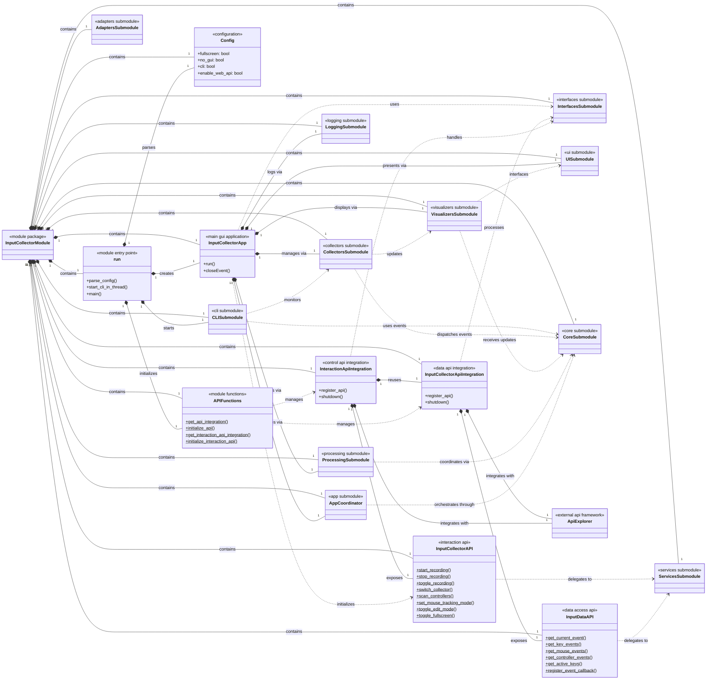

```mermaid
classDiagram
    direction LR
    
    %% Main Application Entry Points
    class run {
        <<module entry point>>
        +parse_config()
        +start_cli_in_thread()
        +main()
    }
    
    class InputCollectorApp {
        <<main gui application>>
        +run()
        +closeEvent()
    }
    
    %% Core APIs
    class InputCollectorAPI {
        <<interaction api>>
        +start_recording()$
        +stop_recording()$
        +toggle_recording()$
        +switch_collector()$
        +scan_controllers()$
        +set_mouse_tracking_mode()$
        +toggle_edit_mode()$
        +toggle_fullscreen()$
    }
    
    class InputDataAPI {
        <<data access api>>
        +get_current_event()$
        +get_key_events()$
        +get_mouse_events()$
        +get_controller_events()$
        +get_active_keys()$
        +register_event_callback()$
    }
    
    %% API Integration
    class InputCollectorApiIntegration {
        <<data api integration>>
        +register_api()
        +shutdown()
    }
    
    class InteractionApiIntegration {
        <<control api integration>>
        +register_api()
        +shutdown()
    }
    
    %% Configuration
    class Config {
        <<configuration>>
        +fullscreen: bool
        +no_gui: bool
        +cli: bool
        +enable_web_api: bool
    }
    
    %% API Functions
    class APIFunctions {
        <<module functions>>
        +get_api_integration()$
        +initialize_api()$
        +get_interaction_api_integration()$
        +initialize_interaction_api()$
    }
    
    %% Submodules
    class AppCoordinator {
        <<app submodule>>
    }
    
    class CollectorsSubmodule {
        <<collectors submodule>>
    }
    
    class InterfacesSubmodule {
        <<interfaces submodule>>
    }
    
    class VisualizersSubmodule {
        <<visualizers submodule>>
    }
    
    class LoggingSubmodule {
        <<logging submodule>>
    }
    
    class UISubmodule {
        <<ui submodule>>
    }
    
    class ProcessingSubmodule {
        <<processing submodule>>
    }
    
    class ServicesSubmodule {
        <<services submodule>>
    }
    
    class AdaptersSubmodule {
        <<adapters submodule>>
    }
    
    class CoreSubmodule {
        <<core submodule>>
    }
    
    class CLISubmodule {
        <<cli submodule>>
    }
    
    %% External Framework Components
    class ApiExplorer {
        <<external api framework>>
    }
    
    %% Package Reference
    class InputCollectorModule {
        <<module package>>
    }
    
    %% Package Composition
    InputCollectorModule "1" *-- "1" run : contains
    InputCollectorModule "1" *-- "1" InputCollectorApp : contains
    InputCollectorModule "1" *-- "1" InputCollectorAPI : contains
    InputCollectorModule "1" *-- "1" InputDataAPI : contains
    InputCollectorModule "1" *-- "1" InputCollectorApiIntegration : contains
    InputCollectorModule "1" *-- "1" InteractionApiIntegration : contains
    InputCollectorModule "1" *-- "1" Config : contains
    InputCollectorModule "1" *-- "1" APIFunctions : contains
    
    %% Submodule Composition
    InputCollectorModule "1" *-- "1" AppCoordinator : contains
    InputCollectorModule "1" *-- "1" CollectorsSubmodule : contains
    InputCollectorModule "1" *-- "1" InterfacesSubmodule : contains
    InputCollectorModule "1" *-- "1" VisualizersSubmodule : contains
    InputCollectorModule "1" *-- "1" LoggingSubmodule : contains
    InputCollectorModule "1" *-- "1" UISubmodule : contains
    InputCollectorModule "1" *-- "1" ProcessingSubmodule : contains
    InputCollectorModule "1" *-- "1" ServicesSubmodule : contains
    InputCollectorModule "1" *-- "1" AdaptersSubmodule : contains
    InputCollectorModule "1" *-- "1" CoreSubmodule : contains
    InputCollectorModule "1" *-- "1" CLISubmodule : contains
    
    %% Entry Point Relationships
    run "1" *-- "1" InputCollectorApp : creates
    run "1" *-- "1" Config : parses
    run "1" *-- "1" APIFunctions : initializes
    run "1" *-- "1" CLISubmodule : starts
    
    %% Core Application Architecture
    InputCollectorApp "1" *-- "1" AppCoordinator : coordinates via
    InputCollectorApp "1" *-- "1" CollectorsSubmodule : manages via
    InputCollectorApp "1" *-- "1" UISubmodule : presents via
    InputCollectorApp "1" *-- "1" VisualizersSubmodule : displays via
    InputCollectorApp "1" *-- "1" LoggingSubmodule : logs via
    InputCollectorApp "1" *-- "1" ProcessingSubmodule : processes via
    
    %% API Architecture
    InputCollectorAPI ..> ServicesSubmodule : delegates to
    InputDataAPI ..> ServicesSubmodule : delegates to
    
    InputCollectorApiIntegration "1" *-- "1" InputDataAPI : exposes
    InputCollectorApiIntegration "1" *-- "1" ApiExplorer : integrates with
    
    InteractionApiIntegration "1" *-- "1" InputCollectorAPI : exposes
    InteractionApiIntegration "1" *-- "1" ApiExplorer : integrates with
    InteractionApiIntegration "1" *-- "1" InputCollectorApiIntegration : reuses
    
    %% Service Layer Integration
    InputCollectorApp ..> InputCollectorAPI : initializes
    APIFunctions ..> InputCollectorApiIntegration : manages
    APIFunctions ..> InteractionApiIntegration : manages
    
    %% Cross-Module Dependencies
    InputCollectorApp ..> InterfacesSubmodule : uses
    InputCollectorApiIntegration ..> InterfacesSubmodule : processes
    InteractionApiIntegration ..> InterfacesSubmodule : handles
    
    %% Event System Integration
    CLISubmodule ..> CoreSubmodule : uses events
    CollectorsSubmodule ..> CoreSubmodule : dispatches events
    VisualizersSubmodule ..> CoreSubmodule : receives updates
    ProcessingSubmodule ..> CoreSubmodule : coordinates via
    AppCoordinator ..> CoreSubmodule : orchestrates through
    
    %% Thread-Safe Communication
    CollectorsSubmodule ..> VisualizersSubmodule : updates
    CLISubmodule ..> CollectorsSubmodule : monitors
    VisualizersSubmodule ..> UISubmodule : interfaces
```