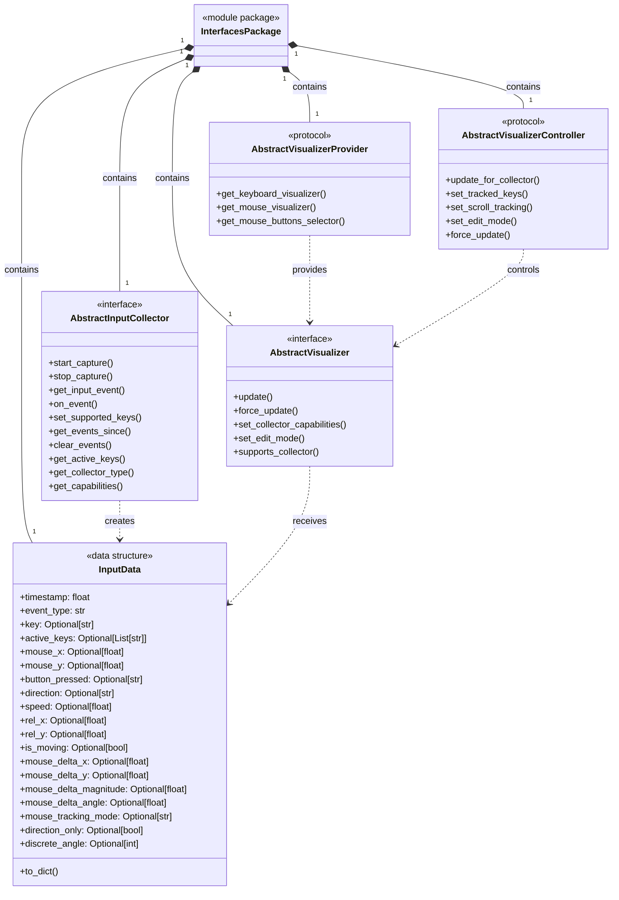

```mermaid
classDiagram
    direction TB
    
    %% Data Class
    class InputData {
        <<data structure>>
        +timestamp: float
        +event_type: str
        +key: Optional[str]
        +active_keys: Optional[List[str]]
        +mouse_x: Optional[float]
        +mouse_y: Optional[float]
        +button_pressed: Optional[str]
        +direction: Optional[str]
        +speed: Optional[float]
        +rel_x: Optional[float]
        +rel_y: Optional[float]
        +is_moving: Optional[bool]
        +mouse_delta_x: Optional[float]
        +mouse_delta_y: Optional[float]
        +mouse_delta_magnitude: Optional[float]
        +mouse_delta_angle: Optional[float]
        +mouse_tracking_mode: Optional[str]
        +direction_only: Optional[bool]
        +discrete_angle: Optional[int]
        +to_dict()
    }
    
    %% Abstract Classes and Interfaces
    class AbstractInputCollector {
        <<interface>>
        +start_capture()
        +stop_capture()
        +get_input_event()
        +on_event()
        +set_supported_keys()
        +get_events_since()
        +clear_events()
        +get_active_keys()
        +get_collector_type()
        +get_capabilities()
    }
    
    class AbstractVisualizer {
        <<interface>>
        +update()
        +force_update()
        +set_collector_capabilities()
        +set_edit_mode()
        +supports_collector()
    }
    
    %% Protocol Interfaces
    class AbstractVisualizerProvider {
        <<protocol>>
        +get_keyboard_visualizer()
        +get_mouse_visualizer()
        +get_mouse_buttons_selector()
    }
    
    class AbstractVisualizerController {
        <<protocol>>
        +update_for_collector()
        +set_tracked_keys()
        +set_scroll_tracking()
        +set_edit_mode()
        +force_update()
    }
    
    %% Package Reference
    class InterfacesPackage {
        <<module package>>
    }
    
    %% Package Composition
    InterfacesPackage "1" *-- "1" InputData : contains
    InterfacesPackage "1" *-- "1" AbstractInputCollector : contains
    InterfacesPackage "1" *-- "1" AbstractVisualizer : contains
    InterfacesPackage "1" *-- "1" AbstractVisualizerProvider : contains
    InterfacesPackage "1" *-- "1" AbstractVisualizerController : contains
    
    %% Core Relationships
    AbstractInputCollector ..> InputData : creates
    AbstractVisualizer ..> InputData : receives
    
    %% Protocol Dependencies
    AbstractVisualizerProvider ..> AbstractVisualizer : provides
    AbstractVisualizerController ..> AbstractVisualizer : controls
```