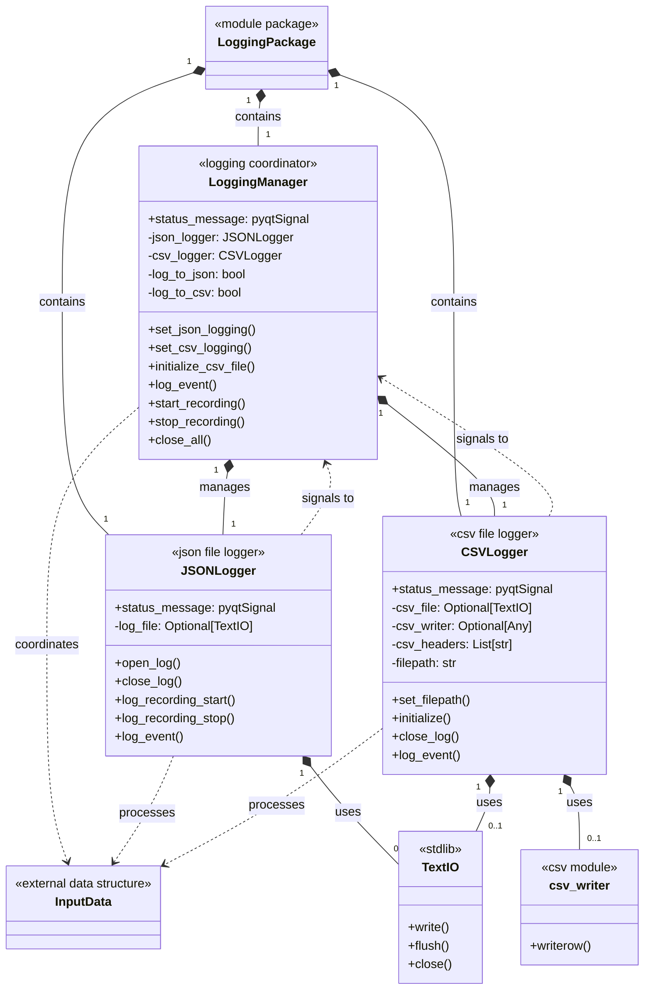

```mermaid
classDiagram
    direction TB
    
    %% Manager Class
    class LoggingManager {
        <<logging coordinator>>
        +status_message: pyqtSignal
        -json_logger: JSONLogger
        -csv_logger: CSVLogger
        -log_to_json: bool
        -log_to_csv: bool
        +set_json_logging()
        +set_csv_logging()
        +initialize_csv_file()
        +log_event()
        +start_recording()
        +stop_recording()
        +close_all()
    }
    
    %% JSON Logger
    class JSONLogger {
        <<json file logger>>
        +status_message: pyqtSignal
        -log_file: Optional[TextIO]
        +open_log()
        +close_log()
        +log_recording_start()
        +log_recording_stop()
        +log_event()
    }
    
    %% CSV Logger
    class CSVLogger {
        <<csv file logger>>
        +status_message: pyqtSignal
        -csv_file: Optional[TextIO]
        -csv_writer: Optional[Any]
        -csv_headers: List[str]
        -filepath: str
        +set_filepath()
        +initialize()
        +close_log()
        +log_event()
    }
    
    %% Data Structure (Reference)
    class InputData {
        <<external data structure>>
    }
    
    %% Standard Library (Essential)
    class TextIO {
        <<stdlib>>
        +write()
        +flush()
        +close()
    }
    
    class csv_writer {
        <<csv module>>
        +writerow()
    }
    
    %% Package Reference
    class LoggingPackage {
        <<module package>>
    }
    
    %% Package Composition
    LoggingPackage "1" *-- "1" LoggingManager : contains
    LoggingPackage "1" *-- "1" JSONLogger : contains
    LoggingPackage "1" *-- "1" CSVLogger : contains
    
    %% Manager Composition
    LoggingManager "1" *-- "1" JSONLogger : manages
    LoggingManager "1" *-- "1" CSVLogger : manages
    
    %% Data Processing
    LoggingManager ..> InputData : coordinates
    JSONLogger ..> InputData : processes
    CSVLogger ..> InputData : processes
    
    %% File I/O Dependencies
    JSONLogger "1" *-- "0..1" TextIO : uses
    CSVLogger "1" *-- "0..1" TextIO : uses
    CSVLogger "1" *-- "0..1" csv_writer : uses
    
    %% Signal Connections
    JSONLogger ..> LoggingManager : signals to
    CSVLogger ..> LoggingManager : signals to
```