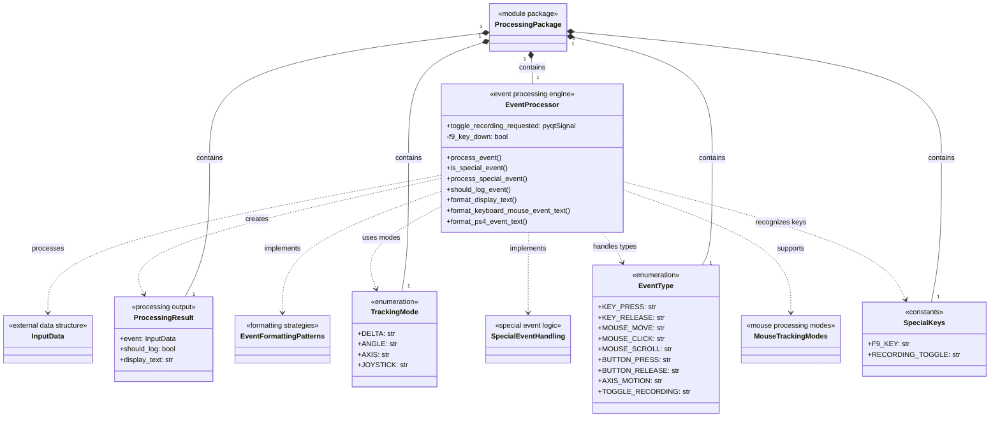

```mermaid
classDiagram
    direction TB
    
    %% Main Event Processor
    class EventProcessor {
        <<event processing engine>>
        +toggle_recording_requested: pyqtSignal
        -f9_key_down: bool
        +process_event()
        +is_special_event()
        +process_special_event()
        +should_log_event()
        +format_display_text()
        +format_keyboard_mouse_event_text()
        +format_ps4_event_text()
    }
    
    %% Data Classes
    class InputData {
        <<external data structure>>
    }
    
    %% Processing Result Structure
    class ProcessingResult {
        <<processing output>>
        +event: InputData
        +should_log: bool
        +display_text: str
    }
    
    %% Tracking Modes Enumeration
    class TrackingMode {
        <<enumeration>>
        +DELTA: str
        +ANGLE: str
        +AXIS: str
        +JOYSTICK: str
    }
    
    %% Event Types Enumeration
    class EventType {
        <<enumeration>>
        +KEY_PRESS: str
        +KEY_RELEASE: str
        +MOUSE_MOVE: str
        +MOUSE_CLICK: str
        +MOUSE_SCROLL: str
        +BUTTON_PRESS: str
        +BUTTON_RELEASE: str
        +AXIS_MOTION: str
        +TOGGLE_RECORDING: str
    }
    
    %% Special Keys
    class SpecialKeys {
        <<constants>>
        +F9_KEY: str
        +RECORDING_TOGGLE: str
    }
    
    %% Processing Patterns
    class EventFormattingPatterns {
        <<formatting strategies>>
    }
    
    class SpecialEventHandling {
        <<special event logic>>
    }
    
    class MouseTrackingModes {
        <<mouse processing modes>>
    }
    
    %% Package Reference
    class ProcessingPackage {
        <<module package>>
    }
    
    %% Package Composition
    ProcessingPackage "1" *-- "1" EventProcessor : contains
    ProcessingPackage "1" *-- "1" ProcessingResult : contains
    ProcessingPackage "1" *-- "1" TrackingMode : contains
    ProcessingPackage "1" *-- "1" EventType : contains
    ProcessingPackage "1" *-- "1" SpecialKeys : contains
    
    %% Core Processing Flow
    EventProcessor ..> InputData : processes
    EventProcessor ..> ProcessingResult : creates
    
    %% Configuration Usage
    EventProcessor ..> TrackingMode : uses modes
    EventProcessor ..> EventType : handles types
    EventProcessor ..> SpecialKeys : recognizes keys
    
    %% Pattern Implementation
    EventProcessor ..> EventFormattingPatterns : implements
    EventProcessor ..> SpecialEventHandling : implements
    EventProcessor ..> MouseTrackingModes : supports
```