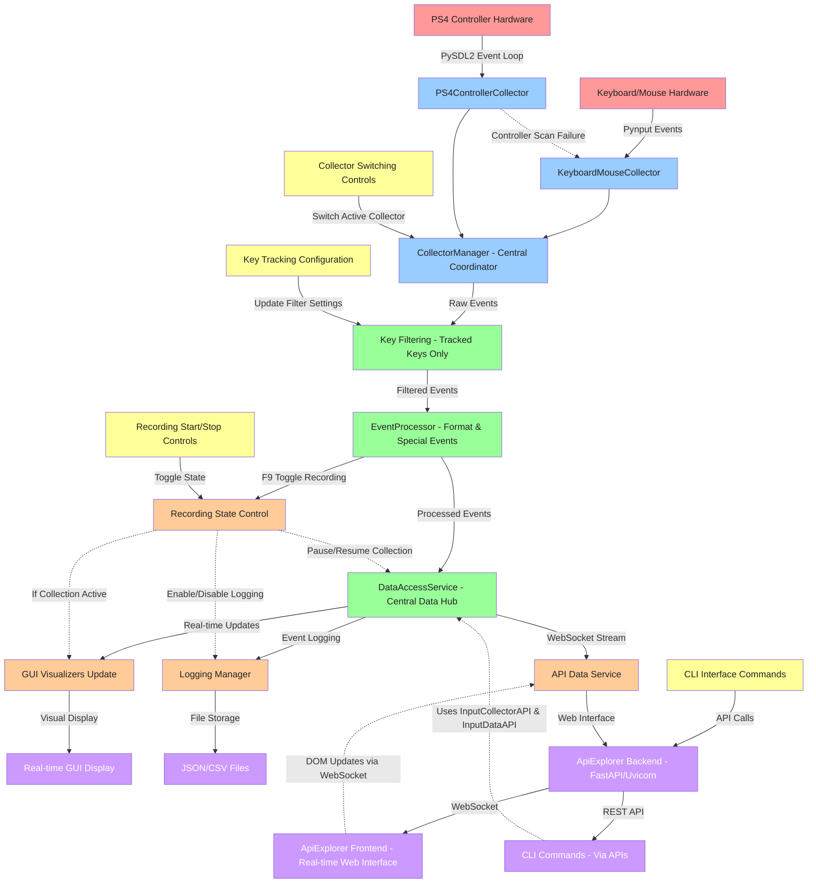

```mermaid
flowchart TD
    %% Hardware Input Sources
    A[Keyboard/Mouse Hardware] -->|Pynput Events| A1[KeyboardMouseCollector]
    A2[PS4 Controller Hardware] -->|PySDL2 Event Loop| A3[PS4ControllerCollector]
    
    %% Collection Layer
    A1 --> B1[CollectorManager - Central Coordinator]
    A3 --> B1
    A3 -.->|Controller Scan Failure| A1
    
    %% Processing Layer
    B1 -->|Raw Events| C1[Key Filtering - Tracked Keys Only]
    C1 -->|Filtered Events| C2[EventProcessor - Format & Special Events]
    C2 -->|F9 Toggle Recording| D4[Recording State Control]
    C2 -->|Processed Events| C3[DataAccessService - Central Data Hub]
    
    %% Event Distribution Branches
    C3 -->|Real-time Updates| D1[GUI Visualizers Update]
    C3 -->|Event Logging| D2[Logging Manager]
    C3 -->|WebSocket Stream| D3[API Data Service]
    
    %% Output Destinations
    D1 -->|Visual Display| E1[Real-time GUI Display]
    D2 -->|File Storage| E2[JSON/CSV Files]
    
    %% API Backend Distribution
    E3 -->|WebSocket| E4[ApiExplorer Frontend - Real-time Web Interface]
    E3 -->|REST API| E5[CLI Commands - Via APIs]
    
    %% User Controls Flow
    F1[Recording Start/Stop Controls] -->|Toggle State| D4
    F2[Collector Switching Controls] -->|Switch Active Collector| B1
    F3[Key Tracking Configuration] -->|Update Filter Settings| C1
    F4[CLI Interface Commands] -->|API Calls| E3

    D3 -->|Web Interface| E3[ApiExplorer Backend - FastAPI/Uvicorn]
    
    %% Control State Management
    D4 -.->|Pause/Resume Collection| C3
    D4 -.->|Enable/Disable Logging| D2
    D4 -.->|If Collection Active| D1
    
    %% Data Integration
    E5 -.->|Uses InputCollectorAPI & InputDataAPI| C3
    E4 -.->|DOM Updates via WebSocket| D3
    
    %% Styling
    classDef hardware fill:#ff9999,color:#222
    classDef collection fill:#99ccff,color:#222
    classDef processing fill:#99ff99,color:#222
    classDef distribution fill:#ffcc99,color:#222
    classDef output fill:#cc99ff,color:#fff
    classDef control fill:#ffff99,color:#222
    
    class A,A2 hardware
    class A1,A3,B1 collection
    class C1,C2,C3 processing
    class D1,D2,D3,D4 distribution
    class E1,E2,E3,E4,E5 output
    class F1,F2,F3,F4 control
```