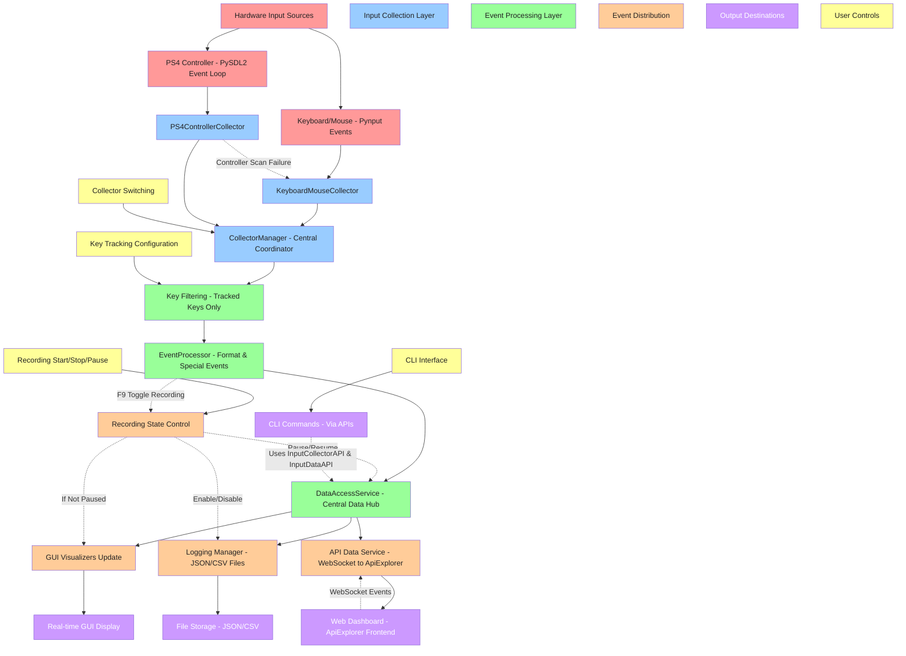

```mermaid
flowchart TD
    %% Input Sources
    A[Hardware Input Sources]
    A1[Keyboard/Mouse - Pynput Events]
    A2[PS4 Controller - PySDL2 Event Loop]
    
    %% Collection Layer
    B[Input Collection Layer]
    B1[KeyboardMouseCollector]
    B2[PS4ControllerCollector]
    B3[CollectorManager - Central Coordinator]
    
    %% Processing Layer
    C[Event Processing Layer]
    C1[Key Filtering - Tracked Keys Only]
    C2[EventProcessor - Format & Special Events]
    C3[DataAccessService - Central Data Hub]
    
    %% Distribution Layer
    D[Event Distribution]
    D1[GUI Visualizers Update]
    D2[Logging Manager - JSON/CSV Files]
    D3[API Data Service - WebSocket to ApiExplorer]
    D4[Recording State Control]
    
    %% Output Destinations
    E[Output Destinations]
    E1[Real-time GUI Display]
    E2[File Storage - JSON/CSV]
    E3[Web Dashboard - ApiExplorer Frontend]
    E4[CLI Commands - Via APIs]
    
    %% Control Flow
    F[User Controls]
    F1[Recording Start/Stop/Pause]
    F2[Collector Switching]
    F3[Key Tracking Configuration]
    F4[CLI Interface]
    
    %% Flow Connections
    A --> A1
    A --> A2
    
    A1 --> B1
    A2 --> B2
    
    B1 --> B3
    B2 --> B3
    
    B3 --> C1
    C1 --> C2
    C2 --> C3
    
    C3 --> D1
    C3 --> D2
    C3 --> D3
    
    D1 --> E1
    D2 --> E2
    D3 --> E3
    
    %% Control Flows
    F1 --> D4
    F2 --> B3
    F3 --> C1
    F4 --> E4
    
    D4 -.->|Pause/Resume| C3
    D4 -.->|Enable/Disable| D2
    
    %% API Integration
    E4 -.->|Uses InputCollectorAPI & InputDataAPI| C3
    E3 -.->|WebSocket Events| D3
    
    %% Fallback Mechanism
    B2 -.->|Controller Scan Failure| B1
    
    %% Special Event Handling
    C2 -.->|F9 Toggle Recording| D4
    
    %% GUI Updates Conditional
    D4 -.->|If Not Paused| D1
    
    %% Styling
    classDef input fill:#ff9999,color:#222
    classDef collection fill:#99ccff,color:#222
    classDef processing fill:#99ff99,color:#222
    classDef distribution fill:#ffcc99,color:#222
    classDef output fill:#cc99ff,color:#fff
    classDef control fill:#ffff99,color:#222
    
    class A,A1,A2 input
    class B,B1,B2,B3 collection
    class C,C1,C2,C3 processing
    class D,D1,D2,D3,D4 distribution
    class E,E1,E2,E3,E4 output
    class F,F1,F2,F3,F4 control
```