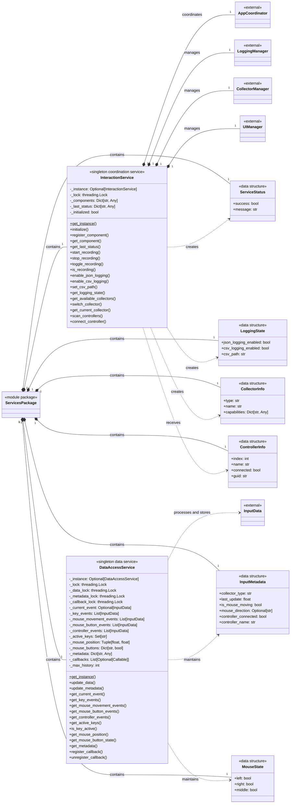

```mermaid
classDiagram
    direction LR
    
    %% Singleton Services
    class InteractionService {
        <<singleton coordination service>>
        -_instance: Optional[InteractionService]
        -_lock: threading.Lock
        -_components: Dict[str, Any]
        -_last_status: Dict[str, Any]
        -_initialized: bool
        +get_instance()$
        +initialize()
        +register_component()
        +get_component()
        +get_last_status()
        +start_recording()
        +stop_recording()
        +toggle_recording()
        +is_recording()
        +enable_json_logging()
        +enable_csv_logging()
        +set_csv_path()
        +get_logging_state()
        +get_available_collectors()
        +switch_collector()
        +get_current_collector()
        +scan_controllers()
        +connect_controller()
    }
    
    class DataAccessService {
        <<singleton data service>>
        -_instance: Optional[DataAccessService]
        -_lock: threading.Lock
        -_data_lock: threading.Lock
        -_metadata_lock: threading.Lock
        -_callback_lock: threading.Lock
        -_current_event: Optional[InputData]
        -_key_events: List[InputData]
        -_mouse_movement_events: List[InputData]
        -_mouse_button_events: List[InputData]
        -_controller_events: List[InputData]
        -_active_keys: Set[str]
        -_mouse_position: Tuple[float, float]
        -_mouse_buttons: Dict[str, bool]
        -_metadata: Dict[str, Any]
        -_callbacks: List[Optional[Callable]]
        -_max_history: int
        +get_instance()$
        +update_data()
        +update_metadata()
        +get_current_event()
        +get_key_events()
        +get_mouse_movement_events()
        +get_mouse_button_events()
        +get_controller_events()
        +get_active_keys()
        +is_key_active()
        +get_mouse_position()
        +get_mouse_button_state()
        +get_metadata()
        +register_callback()
        +unregister_callback()
    }
    
    %% Data Transfer Objects
    class ServiceStatus {
        <<data structure>>
        +success: bool
        +message: str
    }
    
    class LoggingState {
        <<data structure>>
        +json_logging_enabled: bool
        +csv_logging_enabled: bool
        +csv_path: str
    }
    
    class CollectorInfo {
        <<data structure>>
        +type: str
        +name: str
        +capabilities: Dict[str, Any]
    }
    
    class ControllerInfo {
        <<data structure>>
        +index: int
        +name: str
        +connected: bool
        +guid: str
    }
    
    class InputMetadata {
        <<data structure>>
        +collector_type: str
        +last_update: float
        +is_mouse_moving: bool
        +mouse_direction: Optional[str]
        +controller_connected: bool
        +controller_name: str
    }
    
    class MouseState {
        <<data structure>>
        +left: bool
        +right: bool
        +middle: bool
    }
    
    %% External Dependencies (References)
    class InputData {
        <<external>>
    }
    
    class AppCoordinator {
        <<external>>
    }
    
    class LoggingManager {
        <<external>>
    }
    
    class CollectorManager {
        <<external>>
    }
    
    class UIManager {
        <<external>>
    }
    
    %% Package Reference
    class ServicesPackage {
        <<module package>>
    }
    
    %% Package Composition
    ServicesPackage "1" *-- "1" InteractionService : contains
    ServicesPackage "1" *-- "1" DataAccessService : contains
    ServicesPackage "1" *-- "1" ServiceStatus : contains
    ServicesPackage "1" *-- "1" LoggingState : contains
    ServicesPackage "1" *-- "1" CollectorInfo : contains
    ServicesPackage "1" *-- "1" ControllerInfo : contains
    ServicesPackage "1" *-- "1" InputMetadata : contains
    ServicesPackage "1" *-- "1" MouseState : contains
    
    %% Service Dependencies
    InteractionService "1" *-- "1" AppCoordinator : coordinates
    InteractionService "1" *-- "1" LoggingManager : manages
    InteractionService "1" *-- "1" CollectorManager : manages
    InteractionService "1" *-- "1" UIManager : manages
    
    %% Data Flow
    DataAccessService ..> InputData : processes and stores
    
    %% Data Creation
    InteractionService ..> ServiceStatus : creates
    InteractionService ..> LoggingState : creates
    InteractionService ..> CollectorInfo : creates
    InteractionService ..> ControllerInfo : receives
    
    DataAccessService ..> InputMetadata : maintains
    DataAccessService ..> MouseState : maintains
```