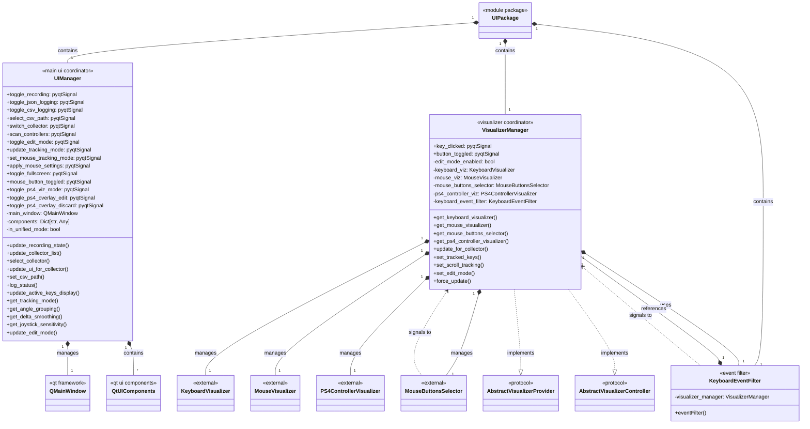

```mermaid
classDiagram
    direction TB
    
    %% Main UI Classes
    class UIManager {
        <<main ui coordinator>>
        +toggle_recording: pyqtSignal
        +toggle_json_logging: pyqtSignal
        +toggle_csv_logging: pyqtSignal
        +select_csv_path: pyqtSignal
        +switch_collector: pyqtSignal
        +scan_controllers: pyqtSignal
        +toggle_edit_mode: pyqtSignal
        +update_tracking_mode: pyqtSignal
        +set_mouse_tracking_mode: pyqtSignal
        +apply_mouse_settings: pyqtSignal
        +toggle_fullscreen: pyqtSignal
        +mouse_button_toggled: pyqtSignal
        +toggle_ps4_viz_mode: pyqtSignal
        +toggle_ps4_overlay_edit: pyqtSignal
        +toggle_ps4_overlay_discard: pyqtSignal
        
        -main_window: QMainWindow
        -components: Dict[str, Any]
        -in_unified_mode: bool
        +update_recording_state()
        +update_collector_list()
        +select_collector()
        +update_ui_for_collector()
        +set_csv_path()
        +log_status()
        +update_active_keys_display()
        +get_tracking_mode()
        +get_angle_grouping()
        +get_delta_smoothing()
        +get_joystick_sensitivity()
        +update_edit_mode()
    }
    
    class VisualizerManager {
        <<visualizer coordinator>>
        +key_clicked: pyqtSignal
        +button_toggled: pyqtSignal
        
        -edit_mode_enabled: bool
        -keyboard_viz: KeyboardVisualizer
        -mouse_viz: MouseVisualizer
        -mouse_buttons_selector: MouseButtonsSelector
        -ps4_controller_viz: PS4ControllerVisualizer
        -keyboard_event_filter: KeyboardEventFilter
        +get_keyboard_visualizer()
        +get_mouse_visualizer()
        +get_mouse_buttons_selector()
        +get_ps4_controller_visualizer()
        +update_for_collector()
        +set_tracked_keys()
        +set_scroll_tracking()
        +set_edit_mode()
        +force_update()
    }
    
    class KeyboardEventFilter {
        <<event filter>>
        -visualizer_manager: VisualizerManager
        +eventFilter()
    }
    
    %% External Visualizers (References)
    class KeyboardVisualizer {
        <<external>>
    }
    
    class MouseVisualizer {
        <<external>>
    }
    
    class MouseButtonsSelector {
        <<external>>
    }
    
    class PS4ControllerVisualizer {
        <<external>>
    }
    
    %% Protocol Interfaces (References)
    class AbstractVisualizerProvider {
        <<protocol>>
    }
    
    class AbstractVisualizerController {
        <<protocol>>
    }
    
    class QMainWindow {
        <<qt framework>>
    }
    
    class QtUIComponents {
        <<qt ui components>>
    }
    
    %% Package Reference
    class UIPackage {
        <<module package>>
    }
    
    %% Package Composition
    UIPackage "1" *-- "1" UIManager : contains
    UIPackage "1" *-- "1" VisualizerManager : contains
    UIPackage "1" *-- "1" KeyboardEventFilter : contains
    
    %% Core Component Relationships
    UIManager "1" *-- "1" QMainWindow : manages
    UIManager "1" *-- "*" QtUIComponents : contains
    
    VisualizerManager "1" *-- "1" KeyboardVisualizer : manages
    VisualizerManager "1" *-- "1" MouseVisualizer : manages
    VisualizerManager "1" *-- "1" MouseButtonsSelector : manages
    VisualizerManager "1" *-- "1" PS4ControllerVisualizer : manages
    VisualizerManager "1" *-- "1" KeyboardEventFilter : uses
    
    KeyboardEventFilter "1" *-- "1" VisualizerManager : references
    
    %% Protocol Implementation
    VisualizerManager ..|> AbstractVisualizerProvider : implements
    VisualizerManager ..|> AbstractVisualizerController : implements
    
    %% Signal Connections
    MouseButtonsSelector ..> VisualizerManager : signals to
    KeyboardEventFilter ..> VisualizerManager : signals to
```