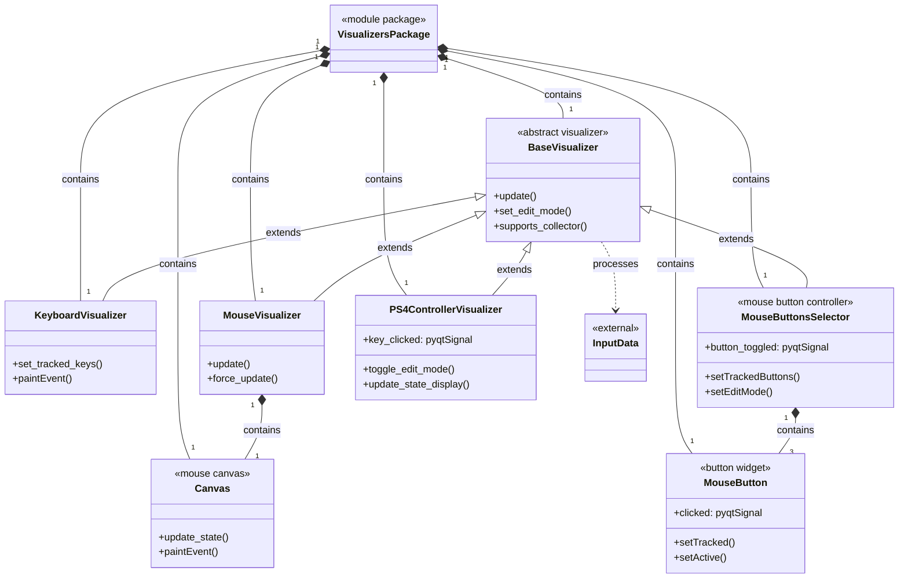

```mermaid
classDiagram
    direction TB
    
    %% Base Classes
    class BaseVisualizer {
        <<abstract visualizer>>
        +update()
        +set_edit_mode()
        +supports_collector()
    }
    
    %% Concrete Visualizers
    class KeyboardVisualizer {
        +set_tracked_keys()
        +paintEvent()
    }
    
    class MouseVisualizer {
        +update()
        +force_update()
    }
    
    class MouseButtonsSelector {
        <<mouse button controller>>
        +button_toggled: pyqtSignal
        +setTrackedButtons()
        +setEditMode()
    }
    
    class PS4ControllerVisualizer {
        +key_clicked: pyqtSignal
        +toggle_edit_mode()
        +update_state_display()
    }
    
    %% Support Components
    class Canvas {
        <<mouse canvas>>
        +update_state()
        +paintEvent()
    }
    
    class MouseButton {
        <<button widget>>
        +clicked: pyqtSignal
        +setTracked()
        +setActive()
    }
    
    %% External References
    class InputData {
        <<external>>
    }
    
    %% Package Reference
    class VisualizersPackage {
        <<module package>>
    }
    
    %% Package Composition
    VisualizersPackage "1" *-- "1" BaseVisualizer : contains
    VisualizersPackage "1" *-- "1" KeyboardVisualizer : contains
    VisualizersPackage "1" *-- "1" MouseVisualizer : contains
    VisualizersPackage "1" *-- "1" MouseButtonsSelector : contains
    VisualizersPackage "1" *-- "1" PS4ControllerVisualizer : contains
    VisualizersPackage "1" *-- "1" Canvas : contains
    VisualizersPackage "1" *-- "1" MouseButton : contains
    
    %% Inheritance
    BaseVisualizer <|-- KeyboardVisualizer : extends
    BaseVisualizer <|-- MouseVisualizer : extends
    BaseVisualizer <|-- MouseButtonsSelector : extends
    BaseVisualizer <|-- PS4ControllerVisualizer : extends
    
    %% Core Composition
    MouseVisualizer "1" *-- "1" Canvas : contains
    MouseButtonsSelector "1" *-- "3" MouseButton : contains
    
    %% Data Processing
    BaseVisualizer ..> InputData : processes
```