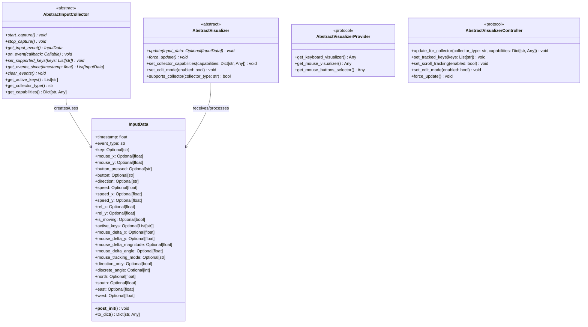

```mermaid
classDiagram
    %% Data Class
    class InputData {
        +timestamp: float
        +event_type: str
        +key: Optional[str]
        +mouse_x: Optional[float]
        +mouse_y: Optional[float]
        +button_pressed: Optional[str]
        +button: Optional[str]
        +direction: Optional[str]
        +speed: Optional[float]
        +speed_x: Optional[float]
        +speed_y: Optional[float]
        +rel_x: Optional[float]
        +rel_y: Optional[float]
        +is_moving: Optional[bool]
        +active_keys: Optional[List[str]]
        +mouse_delta_x: Optional[float]
        +mouse_delta_y: Optional[float]
        +mouse_delta_magnitude: Optional[float]
        +mouse_delta_angle: Optional[float]
        +mouse_tracking_mode: Optional[str]
        +direction_only: Optional[bool]
        +discrete_angle: Optional[int]
        +north: Optional[float]
        +south: Optional[float]
        +east: Optional[float]
        +west: Optional[float]

        +__post_init__() void
        +to_dict() Dict[str, Any]
    }

    %% Abstract Classes and Interfaces
    class AbstractInputCollector {
        <<abstract>>
        +start_capture()* void
        +stop_capture()* void
        +get_input_event()* InputData
        +on_event(callback: Callable)* void
        +set_supported_keys(keys: List[str])* void
        +get_events_since(timestamp: float)* List[InputData]
        +clear_events()* void
        +get_active_keys() List[str]
        +get_collector_type() str
        +get_capabilities() Dict[str, Any]
    }

    class AbstractVisualizer {
        <<abstract>>
        +update(input_data: Optional[InputData])* void
        +force_update()* void
        +set_collector_capabilities(capabilities: Dict[str, Any]) void
        +set_edit_mode(enabled: bool) void
        +supports_collector(collector_type: str) bool
    }

    %% Protocol Interfaces
    class AbstractVisualizerProvider {
        <<protocol>>
        +get_keyboard_visualizer() Any
        +get_mouse_visualizer() Any
        +get_mouse_buttons_selector() Any
    }

    class AbstractVisualizerController {
        <<protocol>>
        +update_for_collector(collector_type: str, capabilities: Dict[str, Any]) void
        +set_tracked_keys(keys: List[str]) void
        +set_scroll_tracking(enabled: bool) void
        +set_edit_mode(enabled: bool) void
        +force_update() void
    }

    %% Relationships
    AbstractInputCollector --> InputData : creates/uses
    AbstractVisualizer --> InputData : receives/processes
```
