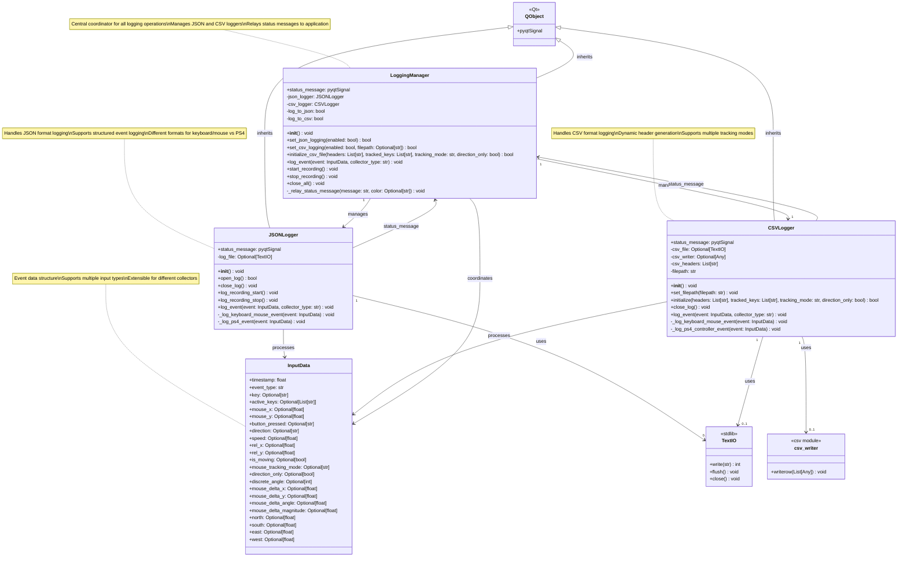

```mermaid
classDiagram
    %% Base Qt Class
    class QObject {
        <<Qt>>
        +pyqtSignal
    }

    %% Manager Class
    class LoggingManager {
        +status_message: pyqtSignal
        -json_logger: JSONLogger
        -csv_logger: CSVLogger
        -log_to_json: bool
        -log_to_csv: bool

        +__init__() void
        +set_json_logging(enabled: bool) bool
        +set_csv_logging(enabled: bool, filepath: Optional[str]) bool
        +initialize_csv_file(headers: List[str], tracked_keys: List[str], tracking_mode: str, direction_only: bool) bool
        +log_event(event: InputData, collector_type: str) void
        +start_recording() void
        +stop_recording() void
        +close_all() void
        -_relay_status_message(message: str, color: Optional[str]) void
    }

    %% JSON Logger
    class JSONLogger {
        +status_message: pyqtSignal
        -log_file: Optional[TextIO]

        +__init__() void
        +open_log() bool
        +close_log() void
        +log_recording_start() void
        +log_recording_stop() void
        +log_event(event: InputData, collector_type: str) void
        -_log_keyboard_mouse_event(event: InputData) void
        -_log_ps4_event(event: InputData) void
    }

    %% CSV Logger
    class CSVLogger {
        +status_message: pyqtSignal
        -csv_file: Optional[TextIO]
        -csv_writer: Optional[Any]
        -csv_headers: List[str]
        -filepath: str

        +__init__() void
        +set_filepath(filepath: str) void
        +initialize(headers: List[str], tracked_keys: List[str], tracking_mode: str, direction_only: bool) bool
        +close_log() void
        +log_event(event: InputData, collector_type: str) void
        -_log_keyboard_mouse_event(event: InputData) void
        -_log_ps4_controller_event(event: InputData) void
    }

    %% Data Classes
    class InputData {
        +timestamp: float
        +event_type: str
        +key: Optional[str]
        +active_keys: Optional[List[str]]
        +mouse_x: Optional[float]
        +mouse_y: Optional[float]
        +button_pressed: Optional[str]
        +direction: Optional[str]
        +speed: Optional[float]
        +rel_x: Optional[float]
        +rel_y: Optional[float]
        +is_moving: Optional[bool]
        +mouse_tracking_mode: Optional[str]
        +direction_only: Optional[bool]
        +discrete_angle: Optional[int]
        +mouse_delta_x: Optional[float]
        +mouse_delta_y: Optional[float]
        +mouse_delta_angle: Optional[float]
        +mouse_delta_magnitude: Optional[float]
        +north: Optional[float]
        +south: Optional[float]
        +east: Optional[float]
        +west: Optional[float]
    }

    %% Standard Library Classes
    class TextIO {
        <<stdlib>>
        +write(str) int
        +flush() void
        +close() void
    }

    class csv_writer {
        <<csv module>>
        +writerow(List[Any]) void
    }

    %% Relationships
    QObject <|-- LoggingManager : inherits
    QObject <|-- JSONLogger : inherits
    QObject <|-- CSVLogger : inherits

    LoggingManager "1" --> "1" JSONLogger : manages
    LoggingManager "1" --> "1" CSVLogger : manages

    JSONLogger --> InputData : processes
    CSVLogger --> InputData : processes
    LoggingManager --> InputData : coordinates

    JSONLogger "1" --> "0..1" TextIO : uses
    CSVLogger "1" --> "0..1" TextIO : uses
    CSVLogger "1" --> "0..1" csv_writer : uses

    %% Signal Connections
    JSONLogger --> LoggingManager : status_message
    CSVLogger --> LoggingManager : status_message

    %% Notes
    note for LoggingManager "Central coordinator for all logging operations\nManages JSON and CSV loggers\nRelays status messages to application"
    note for JSONLogger "Handles JSON format logging\nSupports structured event logging\nDifferent formats for keyboard/mouse vs PS4"
    note for CSVLogger "Handles CSV format logging\nDynamic header generation\nSupports multiple tracking modes"
    note for InputData "Event data structure\nSupports multiple input types\nExtensible for different collectors"
```
