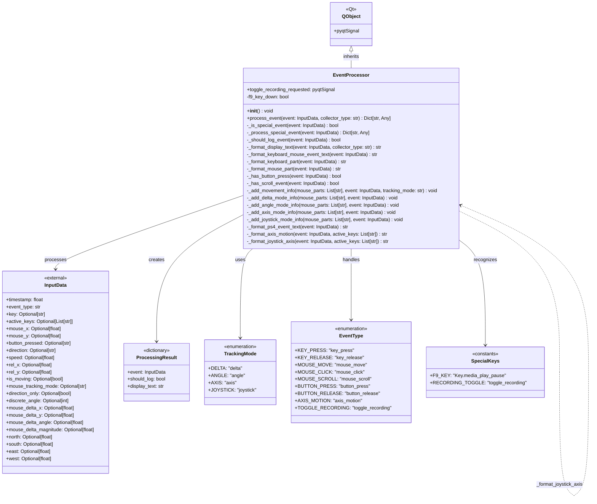

```mermaid
classDiagram
    %% Base Qt Class
    class QObject {
        <<Qt>>
        +pyqtSignal
    }

    %% Main Event Processor
    class EventProcessor {
        +toggle_recording_requested: pyqtSignal
        -f9_key_down: bool

        +__init__() void
        +process_event(event: InputData, collector_type: str) Dict[str, Any]
        -_is_special_event(event: InputData) bool
        -_process_special_event(event: InputData) Dict[str, Any]
        -_should_log_event(event: InputData) bool
        -_format_display_text(event: InputData, collector_type: str) str
        -_format_keyboard_mouse_event_text(event: InputData) str
        -_format_keyboard_part(event: InputData) str
        -_format_mouse_part(event: InputData) str
        -_has_button_press(event: InputData) bool
        -_has_scroll_event(event: InputData) bool
        -_add_movement_info(mouse_parts: List[str], event: InputData, tracking_mode: str) void
        -_add_delta_mode_info(mouse_parts: List[str], event: InputData) void
        -_add_angle_mode_info(mouse_parts: List[str], event: InputData) void
        -_add_axis_mode_info(mouse_parts: List[str], event: InputData) void
        -_add_joystick_mode_info(mouse_parts: List[str], event: InputData) void
        -_format_ps4_event_text(event: InputData) str
        -_format_axis_motion(event: InputData, active_keys: List[str]) str
        -_format_joystick_axis(event: InputData, active_keys: List[str]) str
    }

    %% Data Classes
    class InputData {
        <<external>>
        +timestamp: float
        +event_type: str
        +key: Optional[str]
        +active_keys: Optional[List[str]]
        +mouse_x: Optional[float]
        +mouse_y: Optional[float]
        +button_pressed: Optional[str]
        +direction: Optional[str]
        +speed: Optional[float]
        +rel_x: Optional[float]
        +rel_y: Optional[float]
        +is_moving: Optional[bool]
        +mouse_tracking_mode: Optional[str]
        +direction_only: Optional[bool]
        +discrete_angle: Optional[int]
        +mouse_delta_x: Optional[float]
        +mouse_delta_y: Optional[float]
        +mouse_delta_angle: Optional[float]
        +mouse_delta_magnitude: Optional[float]
        +north: Optional[float]
        +south: Optional[float]
        +east: Optional[float]
        +west: Optional[float]
    }

    %% Processing Result Structure
    class ProcessingResult {
        <<dictionary>>
        +event: InputData
        +should_log: bool
        +display_text: str
    }

    %% Tracking Modes Enumeration
    class TrackingMode {
        <<enumeration>>
        +DELTA: "delta"
        +ANGLE: "angle"
        +AXIS: "axis"
        +JOYSTICK: "joystick"
    }

    %% Event Types Enumeration
    class EventType {
        <<enumeration>>
        +KEY_PRESS: "key_press"
        +KEY_RELEASE: "key_release"
        +MOUSE_MOVE: "mouse_move"
        +MOUSE_CLICK: "mouse_click"
        +MOUSE_SCROLL: "mouse_scroll"
        +BUTTON_PRESS: "button_press"
        +BUTTON_RELEASE: "button_release"
        +AXIS_MOTION: "axis_motion"
        +TOGGLE_RECORDING: "toggle_recording"
    }

    %% Special Keys
    class SpecialKeys {
        <<constants>>
        +F9_KEY: "Key.media_play_pause"
        +RECORDING_TOGGLE: "toggle_recording"
    }

    %% Relationships
    QObject <|-- EventProcessor : inherits

    EventProcessor --> InputData : processes
    EventProcessor --> ProcessingResult : creates
    EventProcessor --> TrackingMode : uses
    EventProcessor --> EventType : handles
    EventProcessor --> SpecialKeys : recognizes

    %% Processing Flow
    EventProcessor ..> EventProcessor : _is_special_event
    EventProcessor ..> EventProcessor : _process_special_event
    EventProcessor ..> EventProcessor : _should_log_event
    EventProcessor ..> EventProcessor : _format_display_text

    %% Formatting Chain
    EventProcessor ..> EventProcessor : _format_keyboard_mouse_event_text
    EventProcessor ..> EventProcessor : _format_ps4_event_text
    EventProcessor ..> EventProcessor : _format_keyboard_part
    EventProcessor ..> EventProcessor : _format_mouse_part
    EventProcessor ..> EventProcessor : _add_movement_info

    %% Movement Info Formatters
    EventProcessor ..> EventProcessor : _add_delta_mode_info
    EventProcessor ..> EventProcessor : _add_angle_mode_info
    EventProcessor ..> EventProcessor : _add_axis_mode_info
    EventProcessor ..> EventProcessor : _add_joystick_mode_info

    %% PS4 Formatting Chain
    EventProcessor ..> EventProcessor : _format_axis_motion
    EventProcessor ..> EventProcessor : _format_joystick_axis
```
