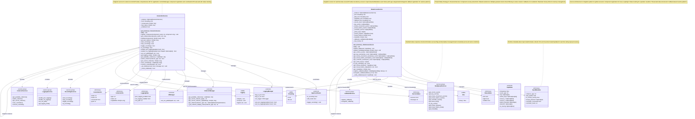

```mermaid
classDiagram
    %% Singleton Services
    class InteractionService {
        -_instance: Optional[InteractionService]
        -_lock: threading.Lock
        -_components: Dict[str, Any]
        -_last_status: Dict[str, Any]
        -_initialized: bool

        +get_instance()$ InteractionService
        +__init__() void
        +register_component(component_name: str, component: Any) void
        +get_component(component_name: str) Any
        +initialize(components: Dict[str, Any]) bool
        +get_last_status() Dict[str, Any]
        +start_recording() bool
        +stop_recording() bool
        +toggle_recording() bool
        +is_recording() bool
        +enable_json_logging(enabled: bool) bool
        +enable_csv_logging(enabled: bool, filepath: Optional[str]) bool
        +set_csv_path(filepath: str) bool
        +get_logging_state() Dict[str, Any]
        +get_available_collectors() List[Dict[str, str]]
        +switch_collector(collector_type: str) bool
        +get_current_collector() Dict[str, Any]
        +scan_controllers() List[Dict[str, Any]]
        +connect_controller(index: int) bool
        -_set_status(success: bool, message: str) void
        -_check_initialized() bool
    }

    class DataAccessService {
        -_instance: Optional[DataAccessService]
        -_lock: threading.Lock
        -_data_lock: threading.Lock
        -_metadata_lock: threading.Lock
        -_callback_lock: threading.Lock
        -_current_event: Optional[InputData]
        -_key_events: List[InputData]
        -_mouse_movement_events: List[InputData]
        -_mouse_button_events: List[InputData]
        -_controller_events: List[InputData]
        -_active_keys: Set[str]
        -_mouse_position: Tuple[float, float]
        -_mouse_buttons: Dict[str, bool]
        -_metadata: Dict[str, Any]
        -_callbacks: List[Optional[Callable]]
        -_max_history: int

        +get_instance()$ DataAccessService
        +__init__() void
        +update_data(event: InputData) void
        +update_metadata(metadata: Dict[str, Any]) void
        +get_current_event() Optional[InputData]
        +get_key_events(max_count: Optional[int]) List[InputData]
        +get_mouse_movement_events(max_count: Optional[int]) List[InputData]
        +get_mouse_button_events(max_count: Optional[int]) List[InputData]
        +get_controller_events(max_count: Optional[int]) List[InputData]
        +get_active_keys() List[str]
        +is_key_active(key: str) bool
        +get_mouse_position() Tuple[float, float]
        +get_mouse_button_state(button: str) bool
        +get_metadata() Dict[str, Any]
        +register_callback(callback: Callable[[InputData], None]) int
        +unregister_callback(callback_id: int) bool
        -_notify_callbacks(event: InputData) void
    }

    %% Data Transfer Objects
    class ServiceStatus {
        <<dictionary>>
        +success: bool
        +message: str
    }

    class LoggingState {
        <<dictionary>>
        +json_logging_enabled: bool
        +csv_logging_enabled: bool
        +csv_path: str
    }

    class CollectorInfo {
        <<dictionary>>
        +type: str
        +name: str
        +capabilities: Dict[str, Any]
    }

    class ControllerInfo {
        <<dictionary>>
        +index: int
        +name: str
        +connected: bool
        +guid: str
    }

    class InputMetadata {
        <<dictionary>>
        +collector_type: str
        +last_update: float
        +is_mouse_moving: bool
        +mouse_direction: Optional[str]
        +controller_connected: bool
        +controller_name: str
    }

    class MouseState {
        <<dictionary>>
        +left: bool
        +right: bool
        +middle: bool
    }

    %% External Dependencies
    class InputData {
        <<external>>
        +timestamp: float
        +event_type: str
        +key: Optional[str]
        +active_keys: Optional[List[str]]
        +mouse_x: Optional[float]
        +mouse_y: Optional[float]
        +button_pressed: Optional[str]
        +direction: Optional[str]
        +is_moving: Optional[bool]
    }

    class AppCoordinator {
        <<external>>
        +is_recording: bool
        +edit_mode: bool
        +toggle_recording() void
    }

    class LoggingManager {
        <<external>>
        +log_to_json: bool
        +log_to_csv: bool
        +csv_logger: CSVLogger
        +set_json_logging(enabled: bool) bool
        +set_csv_logging(enabled: bool) bool
    }

    class CollectorManager {
        <<external>>
        +get_available_collectors() List[Dict[str, str]]
        +get_current_collector_type() str
        +get_current_collector_capabilities() Dict[str, Any]
        +get_collector(collector_type: str) Optional[AbstractInputCollector]
        +_get_collector_display_name(collector_type: str) str
    }

    class UIManager {
        <<external>>
        +set_csv_path(filepath: str) void
    }

    %% Threading Utilities
    class threading {
        <<stdlib>>
        +Lock
        +RLock
    }

    class logging {
        <<stdlib>>
        +info(str) void
        +error(str) void
        +log(int, str) void
    }

    class time {
        <<stdlib>>
        +time() float
    }

    %% Service Categories
    class RecordingServices {
        <<service group>>
        +start_recording()
        +stop_recording()
        +toggle_recording()
        +is_recording()
    }

    class LoggingServices {
        <<service group>>
        +enable_json_logging()
        +enable_csv_logging()
        +set_csv_path()
        +get_logging_state()
    }

    class CollectorServices {
        <<service group>>
        +get_available_collectors()
        +switch_collector()
        +get_current_collector()
        +scan_controllers()
        +connect_controller()
    }

    class DataQueryServices {
        <<service group>>
        +get_current_event()
        +get_key_events()
        +get_mouse_movement_events()
        +get_mouse_button_events()
        +get_controller_events()
        +get_active_keys()
        +is_key_active()
        +get_mouse_position()
        +get_mouse_button_state()
        +get_metadata()
    }

    class CallbackServices {
        <<service group>>
        +register_callback()
        +unregister_callback()
    }

    %% Relationships
    InteractionService --> AppCoordinator : coordinates
    InteractionService --> LoggingManager : manages
    InteractionService --> CollectorManager : manages
    InteractionService --> UIManager : manages

    DataAccessService --> InputData : processes/stores

    InteractionService --> ServiceStatus : creates/returns
    InteractionService --> LoggingState : creates/returns
    InteractionService --> CollectorInfo : creates/returns
    InteractionService --> ControllerInfo : receives/returns

    DataAccessService --> InputMetadata : maintains
    DataAccessService --> MouseState : maintains

    InteractionService --> threading : uses for synchronization
    DataAccessService --> threading : uses for thread safety
    InteractionService --> logging : uses for status
    DataAccessService --> logging : uses for errors
    DataAccessService --> time : uses for timestamps

    %% Service Groupings
    InteractionService ..> RecordingServices : provides
    InteractionService ..> LoggingServices : provides
    InteractionService ..> CollectorServices : provides

    DataAccessService ..> DataQueryServices : provides
    DataAccessService ..> CallbackServices : provides

    %% Singleton Pattern
    InteractionService --|> InteractionService : singleton instance
    DataAccessService --|> DataAccessService : singleton instance

    %% Notes
    note for InteractionService "Singleton service for external control\nProvides comprehensive API for application control\nManages component registration and coordination\nThread-safe with status tracking"

    note for DataAccessService "Singleton service for real-time data access\nProvides low-latency access to input streams\nMaintains event history with type categorization\nSupports callback registration for reactive patterns"

    note for ServiceStatus "Standard status response structure\nIncludes success flag and descriptive message\nUsed consistently across all service methods"

    note for InputMetadata "Runtime metadata about input state\nIncludes collector info and movement state\nUpdated in real-time during input processing"

    %% Thread Safety Documentation
    note "Thread Safety Strategy:\n• InteractionService: Component access protection\n• DataAccessService: Multiple granular locks\n• Event filtering to reduce noise\n• Callback error isolation\n• Maximum history limits for memory management"

    %% Service Architecture
    note "Service Architecture:\n• Singleton pattern for global access\n• Component registration for loose coupling\n• Status tracking for operation results\n• Thread-safe data structures\n• Callback-based reactive patterns"
```
