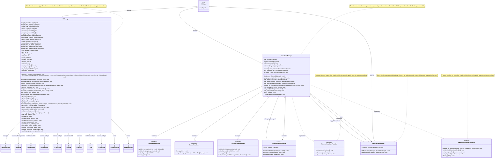

```mermaid
classDiagram
    %% Base Qt Classes
    class QObject {
        <<Qt>>
        +pyqtSignal
    }

    class QMainWindow {
        <<Qt>>
    }

    class QWidget {
        <<Qt>>
    }

    %% Main UI Classes
    class UIManager {
        +toggle_recording: pyqtSignal
        +toggle_json_logging: pyqtSignal
        +toggle_csv_logging: pyqtSignal
        +select_csv_path: pyqtSignal
        +switch_collector: pyqtSignal
        +scan_controllers: pyqtSignal
        +toggle_edit_mode: pyqtSignal
        +update_tracking_mode: pyqtSignal
        +set_mouse_tracking_mode: pyqtSignal
        +apply_mouse_settings: pyqtSignal
        +toggle_fullscreen: pyqtSignal
        +mouse_button_toggled: pyqtSignal
        +toggle_ps4_viz_mode: pyqtSignal
        +toggle_ps4_overlay_edit: pyqtSignal
        +toggle_ps4_overlay_discard: pyqtSignal

        -main_window: QMainWindow
        -dark_bg: str
        -dark_frame_bg: str
        -text_color: str
        -accent_color: str
        -success_color: str
        -warning_color: str
        -error_color: str
        -components: Dict[str, Any]
        -main_layout: QVBoxLayout
        -left_viz_layout: QVBoxLayout
        -in_unified_mode: bool

        +__init__(main_window: QMainWindow) void
        +set_visualizers(keyboard_viz: KeyboardVisualizer, mouse_viz: MouseVisualizer, mouse_buttons: MouseButtonsSelector, ps4_controller_viz: Optional[Any]) void
        +update_recording_state(is_recording: bool) void
        +update_collector_list(collectors: List[Dict[str, str]]) void
        +select_collector(collector_type: str) void
        +update_ui_for_collector(collector_type: str, capabilities: Dict[str, Any]) void
        +set_csv_path(path: str) void
        +log_status(message: str, color: Optional[str]) void
        +update_active_keys_display(active_keys: List[str]) void
        +is_direction_only_mode() bool
        +set_direction_only_checkbox(enabled: bool) void
        +get_tracking_mode() str
        +get_angle_grouping() int
        +get_delta_smoothing() float
        +get_joystick_sensitivity() float
        +update_tracking_modes(valid_modes: List[str], current_mode: str, default_mode: str) void
        +get_current_collector_data() Optional[str]
        +select_collector_by_type(collector_type: str) void
        +update_edit_mode(enabled: bool) void
        +hide_recording_controls() void
        +update_ps4_overlay_edit_state(edit_mode: bool) void
        -_set_dark_theme() void
        -_create_ui() void
        -_create_control_panel() void
        -_create_active_keys_display() void
        -_create_status_area() void
        -_create_mouse_settings() void
        -_on_record_button_clicked() void
        -_update_delta_value_label() void
        -_update_sensitivity_value_label() void
        -_update_angle_grouping_label() void
    }

    class VisualizerManager {
        +key_clicked: pyqtSignal
        +button_toggled: pyqtSignal

        -edit_mode_enabled: bool
        -keyboard_viz: KeyboardVisualizer
        -mouse_viz: MouseVisualizer
        -mouse_buttons_selector: MouseButtonsSelector
        -ps4_controller_viz: PS4ControllerVisualizer
        -keyboard_event_filter: KeyboardEventFilter

        +__init__(parent: Optional[QWidget]) void
        +get_keyboard_visualizer() KeyboardVisualizer
        +get_mouse_visualizer() MouseVisualizer
        +get_mouse_buttons_selector() MouseButtonsSelector
        +get_ps4_controller_visualizer() PS4ControllerVisualizer
        +update_for_collector(collector_type: str, capabilities: Dict[str, Any]) void
        +set_tracked_keys(keys: List[str]) void
        +set_scroll_tracking(enabled: bool) void
        +set_edit_mode(enabled: bool) void
        +force_update() void
        -_setup_keyboard_connections() void
    }

    class KeyboardEventFilter {
        -visualizer_manager: VisualizerManager

        +__init__(visualizer_manager: VisualizerManager) void
        +eventFilter(obj: QObject, event: QEvent) bool
    }

    %% Visualizer Classes (from other modules)
    class KeyboardVisualizer {
        <<external>>
        +get_key_at_position(x: int, y: int) Optional[str]
        +set_tracked_keys(keys: List[str]) void
        +set_edit_mode(enabled: bool) void
        +force_update() void
    }

    class MouseVisualizer {
        <<external>>
        +force_update() void
        +set_collector_capabilities(capabilities: Dict[str, Any]) void
    }

    class MouseButtonsSelector {
        <<external>>
        +button_toggled: pyqtSignal
        +setTrackedButtons(button_ids: List[str]) void
        +setScrollTracking(enabled: bool) void
        +setEditMode(edit_mode: bool) void
    }

    class PS4ControllerVisualizer {
        <<external>>
        +set_tracked_keys(keys: List[str]) void
        +set_edit_mode(enabled: bool) void
        +force_update() void
        +set_collector_capabilities(capabilities: Dict[str, Any]) void
    }

    %% Qt UI Components
    class QPushButton {
        <<Qt>>
    }

    class QComboBox {
        <<Qt>>
    }

    class QCheckBox {
        <<Qt>>
    }

    class QSlider {
        <<Qt>>
    }

    class QTextEdit {
        <<Qt>>
    }

    class QLabel {
        <<Qt>>
    }

    class QGroupBox {
        <<Qt>>
    }

    class QVBoxLayout {
        <<Qt>>
    }

    class QHBoxLayout {
        <<Qt>>
    }

    %% Protocol Interfaces (from interfaces module)
    class AbstractVisualizerProvider {
        <<protocol>>
        +get_keyboard_visualizer() Any
        +get_mouse_visualizer() Any
        +get_mouse_buttons_selector() Any
    }

    class AbstractVisualizerController {
        <<protocol>>
        +update_for_collector(collector_type: str, capabilities: Dict[str, Any]) void
        +set_tracked_keys(keys: List[str]) void
        +set_scroll_tracking(enabled: bool) void
        +set_edit_mode(enabled: bool) void
        +force_update() void
    }

    %% Relationships
    QObject <|-- UIManager : inherits
    QObject <|-- VisualizerManager : inherits
    QObject <|-- KeyboardEventFilter : inherits

    UIManager --> QMainWindow : manages
    UIManager "1" --> "*" QWidget : contains UI components

    VisualizerManager "1" --> "1" KeyboardVisualizer : manages
    VisualizerManager "1" --> "1" MouseVisualizer : manages
    VisualizerManager "1" --> "1" MouseButtonsSelector : manages
    VisualizerManager "1" --> "1" PS4ControllerVisualizer : manages
    VisualizerManager "1" --> "1" KeyboardEventFilter : uses

    KeyboardEventFilter --> VisualizerManager : references

    %% Protocol Implementation (implicit)
    VisualizerManager ..|> AbstractVisualizerProvider : implements
    VisualizerManager ..|> AbstractVisualizerController : implements

    %% Signal Connections
    MouseButtonsSelector --> VisualizerManager : button_toggled signal
    KeyboardEventFilter --> VisualizerManager : key_clicked signal

    %% UI Component Composition
    UIManager --> QPushButton : contains multiple
    UIManager --> QComboBox : contains multiple
    UIManager --> QCheckBox : contains multiple
    UIManager --> QSlider : contains multiple
    UIManager --> QTextEdit : contains
    UIManager --> QLabel : contains multiple
    UIManager --> QGroupBox : contains multiple
    UIManager --> QVBoxLayout : uses
    UIManager --> QHBoxLayout : uses

    %% Notes
    note for UIManager "Main UI controller managing all interface elements\nHandles dark theme, layout, and component coordination\nEmits signals for application actions"
    note for VisualizerManager "Coordinates all visualizer components\nImplements provider and controller interfaces\nManages edit mode and collector-specific visibility"
    note for KeyboardEventFilter "Event filter for keyboard click handling\nEnables key selection in edit mode\nRelay clicks to VisualizerManager"
    note for AbstractVisualizerProvider "Protocol interface for providing visualizers\nImplemented implicitly to avoid metaclass conflicts"
    note for AbstractVisualizerController "Protocol interface for controlling visualizers\nImplemented implicitly to avoid metaclass conflicts"
```
