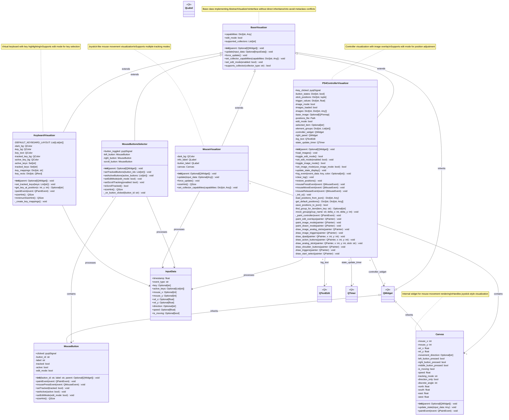

```mermaid
classDiagram
    %% Base Classes
    class BaseVisualizer {
        +capabilities: Dict[str, Any]
        +edit_mode: bool
        +supported_collectors: List[str]

        +__init__(parent: Optional[QWidget]) void
        +update(input_data: Optional[InputData]) void
        +force_update() void
        +set_collector_capabilities(capabilities: Dict[str, Any]) void
        +set_edit_mode(enabled: bool) void
        +supports_collector(collector_type: str) bool
    }

    class QWidget {
        <<Qt>>
    }

    %% Keyboard Visualizer
    class KeyboardVisualizer {
        -DEFAULT_KEYBOARD_LAYOUT: List[List[str]]
        -dark_bg: QColor
        -key_bg: QColor
        -key_text: QColor
        -tracked_key_bg: QColor
        -active_key_bg: QColor
        -active_keys: Set[str]
        -tracked_keys: Set[str]
        -key_mappings: Dict[str, str]
        -key_rects: Dict[str, QRect]

        +__init__(parent: Optional[QWidget]) void
        +set_tracked_keys(keys: List[str]) void
        +get_key_at_position(x: int, y: int) Optional[str]
        +paintEvent(event: QPaintEvent) void
        +sizeHint() QSize
        +minimumSizeHint() QSize
        -_create_key_mappings() void
    }

    %% Mouse Visualizers
    class MouseVisualizer {
        -dark_bg: QColor
        -info_label: QLabel
        -button_label: QLabel
        -canvas: Canvas

        +__init__(parent: Optional[QWidget]) void
        +update(input_data: Optional[Any]) void
        +force_update() void
        +sizeHint() QSize
        +set_collector_capabilities(capabilities: Dict[str, Any]) void
    }

    class Canvas {
        -mouse_x: int
        -mouse_y: int
        -rel_x: float
        -rel_y: float
        -movement_direction: Optional[str]
        -left_button_pressed: bool
        -right_button_pressed: bool
        -middle_button_pressed: bool
        -is_moving: bool
        -speed: float
        -tracking_mode: str
        -direction_only: bool
        -discrete_angle: int
        -north: float
        -south: float
        -east: float
        -west: float

        +__init__(parent: Optional[QWidget]) void
        +update_state(input_data: Any) void
        +paintEvent(event: QPaintEvent) void
    }

    %% Mouse Button Selector
    class MouseButtonsSelector {
        +button_toggled: pyqtSignal
        -left_button: MouseButton
        -right_button: MouseButton
        -scroll_button: MouseButton

        +__init__(parent: Optional[QWidget]) void
        +setTrackedButtons(button_ids: List[str]) void
        +setActiveButtons(active_buttons: List[str]) void
        +setEditMode(edit_mode: bool) void
        +setScrollTracking(enabled: bool) void
        +isScrollTracked() bool
        +sizeHint() QSize
        -_on_button_clicked(button_id: str) void
    }

    class MouseButton {
        +clicked: pyqtSignal
        -button_id: str
        -label: str
        -tracked: bool
        -active: bool
        -edit_mode: bool

        +__init__(button_id: str, label: str, parent: Optional[QWidget]) void
        +paintEvent(event: QPaintEvent) void
        +mousePressEvent(event: QMouseEvent) void
        +setTracked(tracked: bool) void
        +setActive(active: bool) void
        +setEditMode(edit_mode: bool) void
        +sizeHint() QSize
    }

    %% PS4 Controller Visualizer
    class PS4ControllerVisualizer {
        +key_clicked: pyqtSignal
        -button_states: Dict[str, bool]
        -stick_positions: Dict[str, tuple]
        -trigger_values: Dict[str, float]
        -image_mode: bool
        -images_loaded: bool
        -images: Dict[str, Dict[str, Any]]
        -base_image: Optional[QPixmap]
        -positions_file: Path
        -edit_mode: bool
        -selected_item: Optional[str]
        -element_groups: Dict[str, List[str]]
        -controller_widget: QWidget
        -right_panel: QWidget
        -log_text: QTextEdit
        -state_update_timer: QTimer

        +__init__(parent: Optional[QWidget]) void
        +load_images() void
        +toggle_edit_mode() bool
        +set_edit_mode(enabled: bool) void
        +toggle_image_mode() bool
        +set_image_mode(use_image_mode: bool) bool
        +update_state_display() void
        +log_event(event_data: Any, color: Optional[str]) void
        +clear_log() void
        +restore_positions() void
        +mousePressEvent(event: QMouseEvent) void
        +mouseMoveEvent(event: QMouseEvent) void
        +mouseReleaseEvent(event: QMouseEvent) void
        -_init_ui() void
        -load_positions_from_json() Dict[str, Any]
        -get_default_positions() Dict[str, Dict[str, Any]]
        -save_positions_to_json() bool
        -find_group_for_item(item_key: str) Optional[str]
        -move_group(group_name: str, delta_x: int, delta_y: int) void
        -_paint_controller(event: QPaintEvent) void
        -paint_edit_overlays(painter: QPainter) void
        -paint_image_mode(painter: QPainter) void
        -paint_drawn_mode(painter: QPainter) void
        -draw_image_analog_sticks(painter: QPainter) void
        -draw_image_triggers(painter: QPainter) void
        -draw_dpad(painter: QPainter, x: int, y: int) void
        -draw_action_buttons(painter: QPainter, x: int, y: int) void
        -draw_analog_stick(painter: QPainter, x: int, y: int, stick: str) void
        -draw_shoulder_buttons(painter: QPainter) void
        -draw_triggers(painter: QPainter) void
        -draw_start_select(painter: QPainter) void
    }

    %% Data Classes
    class InputData {
        +timestamp: float
        +event_type: str
        +key: Optional[str]
        +active_keys: Optional[List[str]]
        +mouse_x: Optional[int]
        +mouse_y: Optional[int]
        +rel_x: Optional[float]
        +rel_y: Optional[float]
        +direction: Optional[str]
        +speed: Optional[float]
        +is_moving: Optional[bool]
    }

    %% Qt Classes
    class QLabel {
        <<Qt>>
    }

    class QTextEdit {
        <<Qt>>
    }

    class QTimer {
        <<Qt>>
    }

    %% Relationships
    QWidget <|-- BaseVisualizer : inherits
    BaseVisualizer <|-- KeyboardVisualizer : extends
    BaseVisualizer <|-- MouseVisualizer : extends
    BaseVisualizer <|-- MouseButtonsSelector : extends
    BaseVisualizer <|-- PS4ControllerVisualizer : extends

    QWidget <|-- Canvas : inherits
    QWidget <|-- MouseButton : inherits

    MouseVisualizer "1" --> "1" Canvas : contains
    MouseButtonsSelector "1" --> "3" MouseButton : contains
    PS4ControllerVisualizer "1" --> "1" QWidget : controller_widget
    PS4ControllerVisualizer "1" --> "1" QTextEdit : log_text
    PS4ControllerVisualizer "1" --> "1" QTimer : state_update_timer

    KeyboardVisualizer --> InputData : processes
    MouseVisualizer --> InputData : processes
    MouseButtonsSelector --> InputData : processes
    PS4ControllerVisualizer --> InputData : processes

    %% Notes
    note for BaseVisualizer "Base class implementing AbstractVisualizer\ninterface without direct inheritance\nto avoid metaclass conflicts"
    note for KeyboardVisualizer "Virtual keyboard with key highlighting\nSupports edit mode for key selection"
    note for MouseVisualizer "Joystick-like mouse movement visualization\nSupports multiple tracking modes"
    note for PS4ControllerVisualizer "Controller visualization with image overlay\nSupports edit mode for position adjustment"
    note for Canvas "Internal widget for mouse movement rendering\nHandles joystick-style visualization"
```
