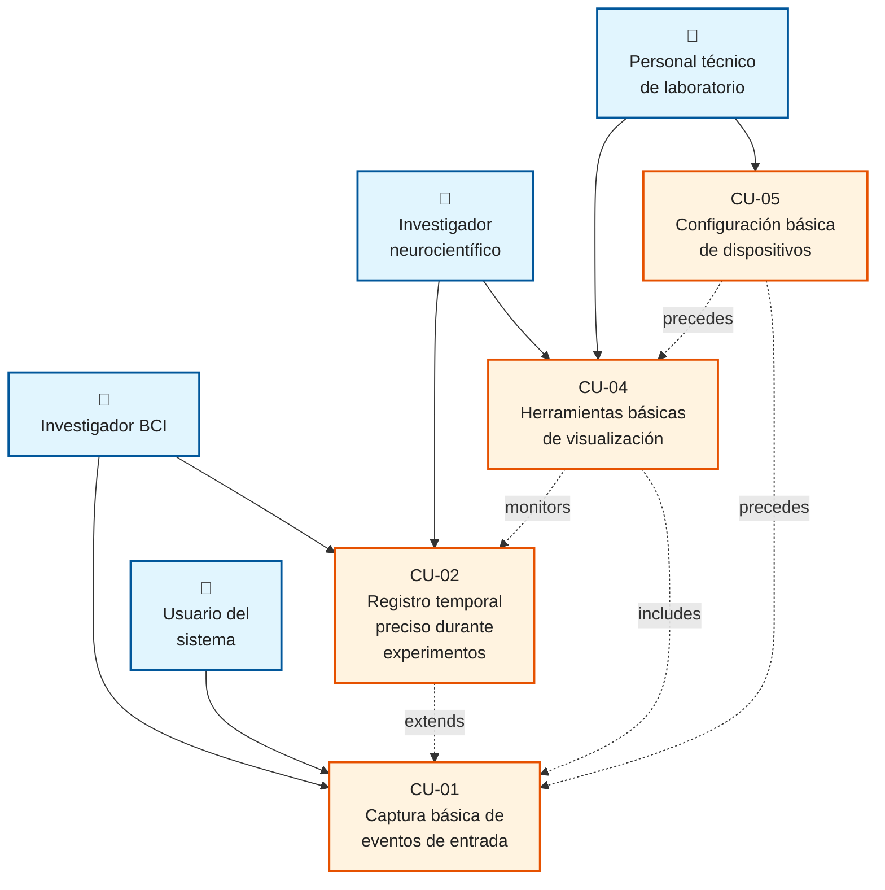

```mermaid
graph TB
    %% Actores
    InvBCI[👤<br/><span style='color:#222'>Investigador BCI</span>]
    InvNeuro[👤<br/><span style='color:#222'>Investigador<br/>neurocientífico</span>]
    TecLab[👤<br/><span style='color:#222'>Personal técnico<br/>de laboratorio</span>]
    Usuario[👤<br/><span style='color:#222'>Usuario del<br/>sistema</span>]

    %% Casos de uso
    CU01[<span style='color:#222'>CU-01<br/>Captura básica de<br/>eventos de entrada</span>]
    CU02[<span style='color:#222'>CU-02<br/>Registro temporal<br/>preciso durante<br/>experimentos</span>]
    CU04[<span style='color:#222'>CU-04<br/>Herramientas básicas<br/>de visualización</span>]
    CU05[<span style='color:#222'>CU-05<br/>Configuración básica<br/>de dispositivos</span>]

    %% Relaciones actores-casos de uso
    InvBCI --> CU01
    InvBCI --> CU02
    InvNeuro --> CU02
    InvNeuro --> CU04
    TecLab --> CU05
    TecLab --> CU04
    Usuario --> CU01

    %% Relaciones entre casos de uso (UML estándar)
    CU02 -.->|extends| CU01
    CU04 -.->|includes| CU01
    CU05 -.->|precedes| CU01
    CU05 -.->|precedes| CU04
    CU04 -.->|monitors| CU02

    %% Estilos
    classDef actor fill:#e1f5fe,stroke:#01579b,stroke-width:2px
    classDef usecase fill:#fff3e0,stroke:#e65100,stroke-width:2px

    class InvBCI,InvNeuro,TecLab,Usuario actor
    class CU01,CU02,CU04,CU05 usecase
```