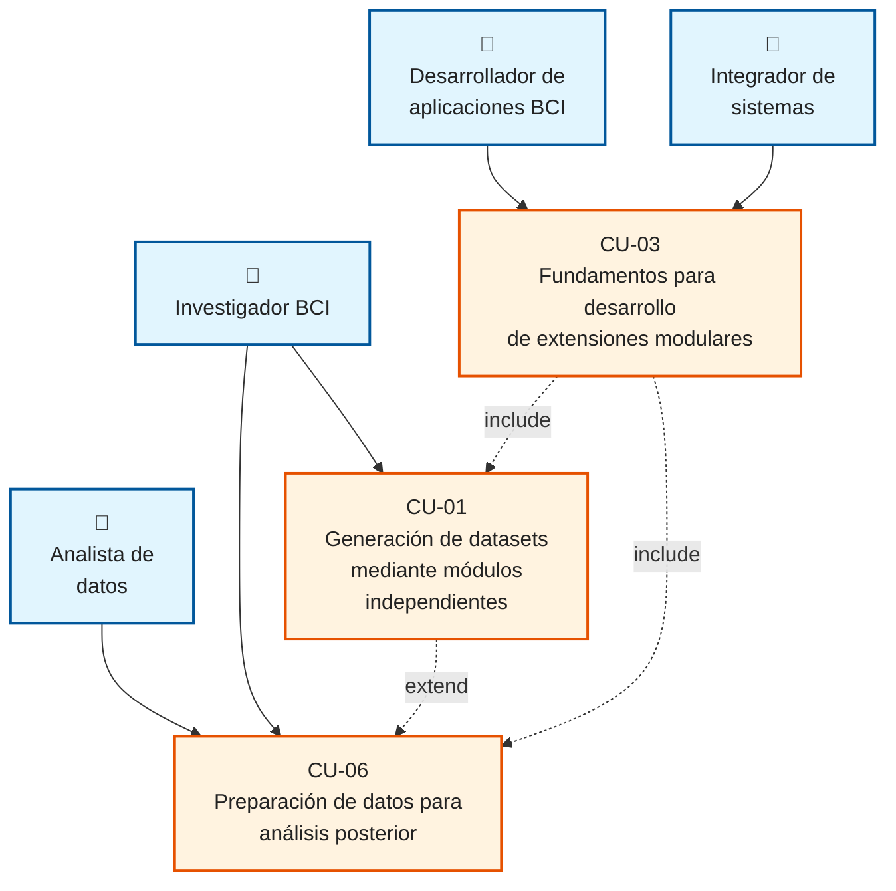

```mermaid
graph TB
    %% Actores
    InvBCI[👤<br/><span style='color:#222'>Investigador BCI</span>]
    DevBCI[👤<br/><span style='color:#222'>Desarrollador de<br/>aplicaciones BCI</span>]
    Integrador[👤<br/><span style='color:#222'>Integrador de<br/>sistemas</span>]
    Analista[👤<br/><span style='color:#222'>Analista de<br/>datos</span>]

    %% Casos de uso
    CU01[<span style='color:#222'>CU-01<br/>Generación de datasets<br/>mediante módulos<br/>independientes</span>]
    CU03[<span style='color:#222'>CU-03<br/>Fundamentos para desarrollo<br/>de extensiones modulares</span>]
    CU06[<span style='color:#222'>CU-06<br/>Preparación de datos para<br/>análisis posterior</span>]

    %% Relaciones actores-casos de uso
    InvBCI --> CU01
    DevBCI --> CU03
    Integrador --> CU03
    Analista --> CU06
    InvBCI --> CU06

    %% Relaciones entre casos de uso (fundamentos arquitectónicos)
    CU03 -.->|include| CU01
    CU01 -.->|extend| CU06
    CU03 -.->|include| CU06

    %% Estilos
    classDef actor fill:#e1f5fe,stroke:#01579b,stroke-width:2px
    classDef usecase fill:#fff3e0,stroke:#e65100,stroke-width:2px

    class InvBCI,DevBCI,Integrador,Analista actor
    class CU01,CU03,CU06 usecase
```