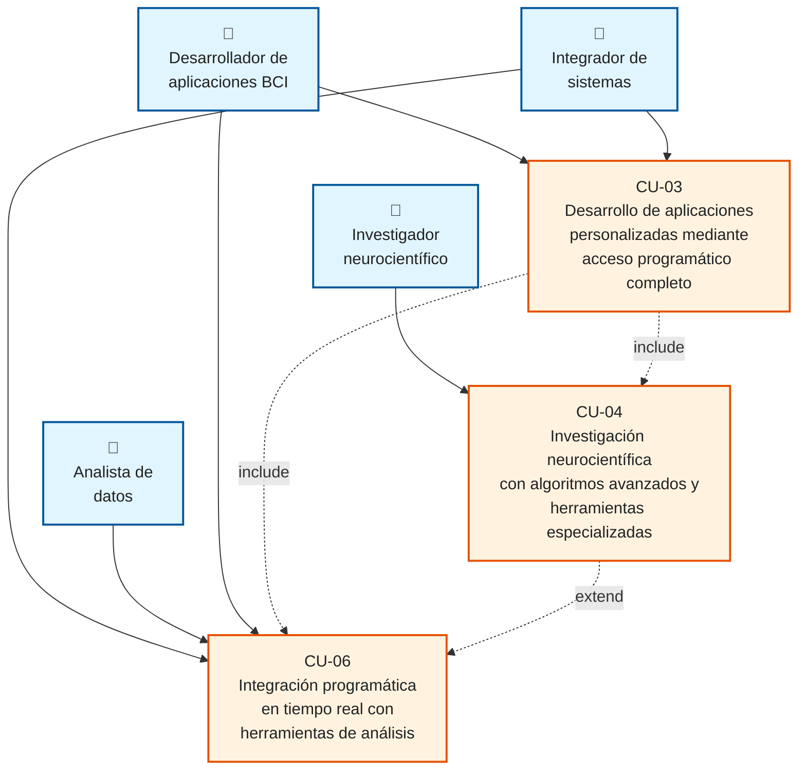

```mermaid
graph TB
    %% Actores
    DevBCI[👤<br/><span style='color:#222'>Desarrollador de<br/>aplicaciones BCI</span>]
    InvNeuro[👤<br/><span style='color:#222'>Investigador<br/>neurocientífico</span>]
    Integrador[👤<br/><span style='color:#222'>Integrador de<br/>sistemas</span>]
    Analista[👤<br/><span style='color:#222'>Analista de<br/>datos</span>]

    %% Casos de uso
    CU03[<span style='color:#222'>CU-03<br/>Desarrollo de aplicaciones<br/>personalizadas mediante<br/>acceso programático completo</span>]
    CU04[<span style='color:#222'>CU-04<br/>Investigación neurocientífica<br/>con algoritmos avanzados y<br/>herramientas especializadas</span>]
    CU06[<span style='color:#222'>CU-06<br/>Integración programática<br/>en tiempo real con<br/>herramientas de análisis</span>]

    %% Relaciones actores-casos de uso
    DevBCI --> CU03
    InvNeuro --> CU04
    Integrador --> CU06
    Integrador --> CU03
    Analista --> CU06
    DevBCI --> CU06

    %% Relaciones entre casos de uso (capacidades avanzadas)
    CU03 -.->|include| CU06
    CU04 -.->|extend| CU06
    CU03 -.->|include| CU04

    %% Estilos
    classDef actor fill:#e1f5fe,stroke:#01579b,stroke-width:2px
    classDef usecase fill:#fff3e0,stroke:#e65100,stroke-width:2px

    class DevBCI,InvNeuro,Integrador,Analista actor
    class CU03,CU04,CU06 usecase
```